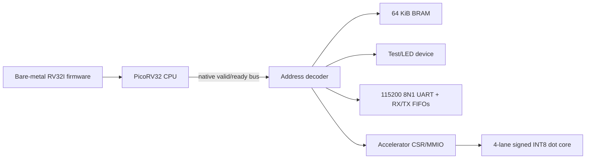

# PicoRV32 INT8 Dot-Product Accelerator

[](https://github.com/masterfrog945-stack/picorv32-int8-dot-accelerator/actions/workflows/rtl-ci.yml)
[](LICENSE)
[](https://www.tulembedded.com/FPGA/ProductsPYNQ-Z2.html)

A reproducible FPGA prototype that couples a PicoRV32 RV32I soft CPU with a
four-lane signed INT8 dot-product accelerator on the PYNQ-Z2. The project
includes the RTL core, memory-mapped control/status registers, 64 KiB firmware
RAM, a UART peripheral, bare-metal firmware, self-checking simulations, board
constraints, and scripted Vivado builds.

This is deliberately described as a **dot-product accelerator prototype**, not
a complete neural-network accelerator. The current compute core evaluates four
parallel INT8 products and accumulates them into one signed 32-bit result.

## Architecture



The complete design runs in the Zynq-7020 programmable logic. The Arm
processing system is not used.

## Highlights

- Four parallel signed INT8 multipliers with a 32-bit accumulator.
- PicoRV32 native single-transaction `valid/ready` memory bus.
- Memory-mapped accelerator registers with sticky completion status and IRQ.
- Bare-metal C driver and independent software golden model.
- Versioned UART command protocol with sequence numbers, payload lengths, and
  CRC-16/CCITT-FALSE error detection.
- Independent 32-byte RX/TX FIFOs with overflow, framing-error, and false-start
  diagnostics.
- Python-driven PING, framed ECHO, UART statistics, accelerator DOT4, and
  PicoRV32 C-reference commands.
- Six directed and configurable randomized board-level DOT4 accuracy cases.
- Standalone accelerator testbench with 1,000 random vectors and eight
  functional coverage goals.
- Two-flop UART RX synchronizer, three-sample majority voting, and a
  firmware-level inter-byte timeout for protocol recovery.
- Scripted simulation, firmware compilation, synthesis, implementation, and
  JTAG programming flows for Vivado 2024.2.

## Memory Map

| Address range | Device | Purpose |
|---|---|---|
| `0x0000_0000-0x0000_FFFF` | RAM | Instructions, data, and stack |
| `0x1000_0000-0x1000_0FFF` | Test device | Sticky PASS/FAIL result for LEDs/testbench |
| `0x2000_0000-0x2000_0FFF` | UART | RX/TX FIFOs, clock divider, levels, and error counters |
| `0x4000_0000-0x4000_0FFF` | Accelerator | Control, vectors, result, status, IRQ |

See [docs/register_map.md](docs/register_map.md) for the register definitions
and [docs/uart_protocol.md](docs/uart_protocol.md) for the wire protocol.

## Measured PYNQ-Z2 Result

The following numbers describe the **complete SoC**, not the accelerator alone.
They were generated by Vivado 2024.2 for `xc7z020clg400-1` at 125 MHz.

| Metric | Result |
|---|---:|
| WNS | `+0.122 ns` |
| WHS | `+0.084 ns` |
| Slice LUTs | 1,748 / 53,200 (3.29%) |
| Slice registers | 1,205 / 106,400 (1.13%) |
| BRAM tiles | 16 / 140 (11.43%) |
| DSP48 blocks | 0 / 220 |
| Routing errors | 0 |
| DRC errors | 0 |

The accelerator currently maps its INT8 multipliers into LUT logic. A future
LUT-versus-DSP48 comparison is intentionally listed in the roadmap rather than
claiming unmeasured DSP performance. Full reports are under
[`results/pynq-z2-125mhz`](results/pynq-z2-125mhz/README.md).

## Requirements

- Windows PowerShell 5.1 or PowerShell 7
- AMD Vivado 2024.2 with support for `xc7z020clg400-1`
- An RV32 bare-metal GCC toolchain (`riscv-none-elf-*`)
- Python 3 and `pyserial` for the host UART test
- PYNQ-Z2 and a 3.3 V CP2102-compatible USB/UART adapter for board testing

Clone the repository with its pinned PicoRV32 dependency:

```bash
git clone --recursive https://github.com/masterfrog945-stack/picorv32-int8-dot-accelerator.git
```

If it was cloned without `--recursive`:

```bash
git submodule update --init --recursive
```

Set tool locations when they are not already in `PATH`:

```powershell
$env:VIVADO_BIN = 'C:\Xilinx\Vivado\2024.2\bin'
$env:RISCV_TOOLCHAIN_BIN = 'C:\riscv-none-elf\bin'
```

The optional installer downloads the pinned xPack Windows toolchain into the
ignored local `.tools` directory:

```powershell
powershell -ExecutionPolicy Bypass -File .\scripts\install_riscv_toolchain.ps1
$env:RISCV_TOOLCHAIN_BIN = (Resolve-Path '.\.tools\riscv-none-elf-gcc\xpack-riscv-none-elf-gcc-15.2.0-1\bin').Path
```

## Verification

Run the complete simulation and out-of-context synthesis suite:

```powershell
powershell -ExecutionPolicy Bypass -File .\scripts\run_all.ps1
```

Run only the firmware-driven SoC and UART simulation:

```powershell
powershell -ExecutionPolicy Bypass -File .\scripts\run_soc_sim.ps1
```

Generate the routed PYNQ-Z2 bitstream:

```powershell
powershell -ExecutionPolicy Bypass -File .\scripts\run_pynqz2_board.ps1
```

The bitstream is written to:

```text
build/pynqz2_board/pynqz2_accel.bit
```

To create a persistent Vivado GUI project instead of using the in-memory build:

```powershell
vivado -mode batch -source .\scripts\create_vivado_project.tcl
```

## Board UART

Use crossed 3.3 V UART wiring. Do not connect the CP2102 5 V/VCC pin.

| CP2102 | PYNQ-Z2 Raspberry Pi header | FPGA package pin | RTL port |
|---|---:|---|---|
| TXD | Physical pin 10 | Y6 / RPIO15 | `uart_rx` |
| RXD | Physical pin 8 | V6 / RPIO14 | `uart_tx` |
| GND | Physical pin 6 | GND | GND |

Install the host dependency, confirm the framed protocol, and then run the
transport and accelerator tests:

```powershell
python -m pip install -r requirements.txt
python .\scripts\uart_echo_test.py --list
python .\scripts\uart_echo_test.py --mode ping --port COM5
python .\scripts\uart_echo_test.py --mode echo --port COM5 --count 10000 --chunk-size 32
python .\scripts\uart_echo_test.py --mode stats --port COM5
python .\scripts\uart_echo_test.py --mode dot4 --port COM5 --count 10000 --cpu-samples 256
```

Framed ECHO validates the transport, FIFO backpressure, and CRC recovery.
DOT4 mode compares every signed INT8 hardware result against a Python golden
model and can measure a PicoRV32 C baseline. Link retries are reported rather
than hidden; a retry-free run remains the strict signal-integrity target.

## Repository Layout

```text
rtl/          synthesizable accelerator, SoC, RAM, CSR, and UART wrappers
sw/           RV32I startup, linker script, driver, and self-test firmware
tb/           self-checking RTL and firmware-driven SoC testbenches
constraints/  standalone, SoC, and adapted PYNQ-Z2 XDC files
scripts/      reproducible firmware, simulation, synthesis, and board flows
docs/         design specification, register map, and detailed explanations
results/      selected post-route reports from the documented reference build
external/     pinned PicoRV32 Git submodule
```

## Known Limitations

- Fixed four-element dot product; no matrix engine or convolution datapath.
- `busy` prevents a new request while an operation is in flight, so this is not
  a one-result-per-cycle streaming pipeline.
- No DMA, cache, or batched accelerator command queue.
- The CPU currently polls completion; accelerator interrupts are not connected
  to the CPU, although `rdcycle` counters are enabled for latency measurement.
- The host transport is limited to 115200 baud and is not representative of a
  production accelerator interconnect.
- No end-to-end neural-network model has been demonstrated yet.

## Roadmap

- [x] Versioned UART command protocol with length and CRC fields.
- [x] Hardware cycle counters and PicoRV32 C baseline measurements.
- [ ] Parameterized/streaming INT8 MAC engine and batched operands.
- [ ] LUT and DSP48 implementations compared for Fmax, area, power, and GOPS.
- [ ] Matrix-vector or fully connected layer accelerator.
- [ ] Python golden model and an end-to-end TinyML inference demonstration.

## License and Third-Party Code

Project-authored RTL, firmware, scripts, and documentation are licensed under
the [Apache License 2.0](LICENSE). PicoRV32 is an independent upstream project
licensed under the ISC License and pinned as a submodule at commit
`87c89acc18994c8cf9a2311e871818e87d304568`. See
[THIRD_PARTY_NOTICES.md](THIRD_PARTY_NOTICES.md) for provenance details.
