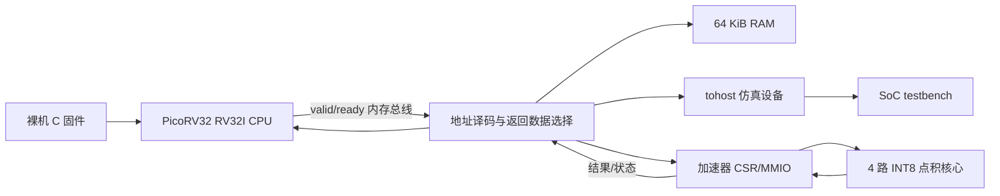

# PicoRV32 + INT8 点积加速器项目代码详解

> 工程目录：`<repo-root>`  
> 目标器件：PYNQ-Z2（XC7Z020）  
> 主要语言：SystemVerilog、Verilog、C、RISC-V 汇编、Tcl、PowerShell  
> 文档目的：让缺少数字电路背景的读者理解这个项目“做了什么、为什么这样做、每部分如何协作，以及当前设计的优势与边界”。

> **本次更新说明**：本文采用“知识点紧跟项目代码”的讲解方式。每个关键知识点都会尽量给出工程中的原始代码，并按以下顺序分析：①代码做了什么；②综合后是什么硬件；③为什么这样写；④如果换一种写法会怎样；⑤它在整个系统中承担什么职责。代码片段均来自当前工程，不以脱离项目的玩具示例代替实际实现。

---

## 目录

1. [先用一句话理解项目](#1-先用一句话理解项目)
2. [阅读 RTL 前必须知道的数字电路概念](#2-阅读-rtl-前必须知道的数字电路概念)
3. [总体架构与端到端工作流程](#3-总体架构与端到端工作流程)
4. [工程目录与模块职责](#4-工程目录与模块职责)
5. [INT8 点积算法](#5-int8-点积算法)
6. [计算核心 `int8_dot_accel`](#6-计算核心-int8_dot_accel)
7. [CSR/MMIO 包装器 `accel_csr`](#7-csrmmio-包装器-accel_csr)
8. [SoC 顶层 `picorv32_accel_soc`](#8-soc-顶层-picorv32_accel_soc)
9. [RAM 与仿真结果设备](#9-ram-与仿真结果设备)
10. [裸机固件如何控制硬件](#10-裸机固件如何控制硬件)
11. [验证体系：怎样证明设计基本可信](#11-验证体系怎样证明设计基本可信)
12. [综合、时序和资源结果](#12-综合时序和资源结果)
13. [设计选择与替代方案比较](#13-设计选择与替代方案比较)
14. [Critical thinking：项目的优点、风险与改进方向](#14-critical-thinking项目的优点风险与改进方向)
15. [建议的阅读与实验顺序](#15-建议的阅读与实验顺序)
16. [自动化与工程辅助代码详解](#16-自动化与工程辅助代码详解)
17. [术语表](#17-术语表)

---

## 1. 先用一句话理解项目

这个项目做了一个小型 RISC-V 计算机系统：PicoRV32 处理器运行 C 程序，通过内存地址访问一个自定义 INT8 点积加速器，加速器完成四组有符号 8 位乘法并求和，软件再把硬件结果与自己的计算结果比较。

如果把它类比成一家公司：

- PicoRV32 是发出任务的“经理”；
- C 固件是经理执行的“工作流程”；
- 地址译码器是“前台分流系统”；
- CSR 寄存器是“任务表单和状态面板”；
- `int8_dot_accel` 是真正执行计算的“专业工人”；
- RAM 是存放程序和数据的“仓库”；
- testbench 是独立的“质量检验部门”。

项目的重点并不只是算出一个点积，而是建立一条完整链路：

```text
C 程序
  → RISC-V 指令
  → CPU 发起总线读写
  → 地址译码
  → CSR 保存输入并启动计算
  → 加速器运算
  → CSR 保存完成状态
  → CPU 读取结果
  → 软件与参考值比较
  → testbench 判定 PASS/FAIL
```

这条链路覆盖了数字 IC 前端岗位中很常见的知识：RTL、流水线、MMIO、寄存器设计、握手协议、软硬件协同、断言、随机测试、综合与时序分析。

---

## 2. 阅读 RTL 前必须知道的数字电路概念

### 2.1 RTL 不是“按行执行的软件”

C 程序通常可以理解为一条语句执行完，再执行下一条。RTL 描述的是同时存在的硬件。

例如：

```systemverilog
assign irq = irq_enable_q && done_pending_q;
```

它不是偶尔执行一次的判断语句，而是代表一个持续存在的与门。只要输入变化，输出组合逻辑就随之变化。

### 2.2 组合逻辑与寄存器

本项目主要有两类逻辑：

| 类型 | 代码形式 | 类比 | 特点 |
|---|---|---|---|
| 组合逻辑 | `always_comb`、`assign` | 计算器 | 输出由当前输入立即决定，不保存历史 |
| 时序逻辑 | `always_ff @(posedge clk)` | 带拍照功能的记事本 | 只在时钟上升沿更新，能保存状态 |

带 `_q` 后缀的信号通常表示寄存器，例如 `vector_a_q`、`done_pending_q`。`q` 可以理解为触发器的输出端。

### 2.3 非阻塞赋值为什么重要

寄存器通常使用 `<=`：

```systemverilog
stage2_valid <= stage1_valid;
```

在一个时钟沿到来时，右侧读取的是时钟沿之前的旧值，所有左侧寄存器在同一轮时序更新中一起获得新值。这正是多个触发器并行工作的硬件语义。

因此下面三段逻辑虽然写在同一个 `always_ff` 中，仍然可以形成流水线：

```text
输入寄存器 → 乘积寄存器 → 结果寄存器
```

如果把它误解为 C 语言的逐行更新，就无法正确理解 `stage1_valid` 和 `stage2_valid`。

### 2.4 复位的作用

复位给状态寄存器一个已知初值。这个项目采用低有效同步复位：

```systemverilog
always_ff @(posedge clk) begin
    if (!rst_n) begin
        ...
    end
end
```

“低有效”表示 `rst_n=0` 时复位；“同步”表示复位也要等到时钟上升沿才生效。它与 `@(posedge clk or negedge rst_n)` 的异步复位不同。

同步复位的优势是时序分析和复位释放通常更容易控制；代价是没有时钟时无法让寄存器立即复位。最终板级设计仍需保证复位与时钟网络正确。

---

## 3. 总体架构与端到端工作流程

### 3.1 系统结构



#### 3.1.1 先区分三种“在哪里运行”

这张图描述的是**逻辑关系**，并不表示图中每个方框现在都已经成为开发板上的真实硬件。理解本项目时，必须区分下面三个环境。

| 环境 | 实际设备 | 在这里完成什么工作 | 当前是否完成 |
|---|---|---|---|
| 开发与编译环境 | Windows电脑的x86处理器、内存和硬盘 | 编辑代码；RISC-V GCC编译固件；Vivado编译RTL、运行XSim、执行综合和时序分析 | 已完成 |
| 行为仿真环境 | 仍然是Windows电脑，Vivado XSim进程用电脑CPU模拟每个时钟周期 | 模拟PicoRV32、RAM、总线、CSR和点积核心；testbench产生时钟并检查结果 | 已完成 |
| FPGA真实运行环境 | PYNQ-Z2上的Zynq-7020芯片，主要使用PL可编程逻辑 | 将综合后的CPU、译码器、RAM、CSR和点积核心变成真实LUT、触发器、BRAM与连线，在硬件时钟下工作 | 尚未完成bitstream和上板 |

换句话说，目前看到的：

```text
TEST_PASS: PicoRV32 C firmware called INT8 accelerator successfully
```

表示**开发电脑上的XSim成功模拟了这个硬件系统**，并不表示PYNQ-Z2已经实际运行了它。

综合通过也不能等同于上板。综合只是把RTL转换成目标FPGA资源的网表；还需要PS7/时钟、复位、板级约束、Implementation、bitstream和下载，才会真正进入第三个环境。

#### 3.1.2 PYNQ-Z2中的PS与PL：当前项目到底用了哪一部分

PYNQ-Z2上的XC7Z020不是单纯FPGA，它由两大区域组成：

```text
XC7Z020
├── PS（Processing System）
│   ├── 双核 ARM Cortex-A9
│   ├── DDR控制器
│   └── UART、USB、以太网等固定硬件
└── PL（Programmable Logic）
    ├── LUT
    ├── 触发器
    ├── BRAM
    ├── DSP48
    └── 可编程互连
```

当前工程中的 `PicoRV32 RV32I CPU`不是PS中的ARM Cortex-A9，而是一段Verilog RTL：

```systemverilog
picorv32 #(
    .PROGADDR_RESET  (32'h0000_0000),
    .STACKADDR       (32'h0001_0000),
    .ENABLE_COUNTERS (0),
    .ENABLE_IRQ      (0),
    .COMPRESSED_ISA  (0)
) cpu (...);
```

如果以后下载到FPGA，这段RTL会在**PL内部**用LUT和触发器拼成一个“软核CPU”。所谓软核，是指CPU结构由可编程逻辑实现，而不是芯片制造时已经固定好的处理器。

当前工程没有实例化 `Processing System 7`模块，所以：

- PS中的Cortex-A9没有参与当前SoC仿真；
- 板载DDR没有被当前PicoRV32使用；
- PYNQ Linux和Python也没有参与；
- 当前64 KiB存储器计划映射到PL的BRAM，而不是板载DDR。

以后可以选择两条板级路线：

1. 保留PicoRV32软核，让整个小SoC都在PL中运行；
2. 使用PS中的ARM运行软件，通过AXI控制PL中的点积加速器。

第二种更符合PYNQ常见用法，但它是下一阶段架构，不是当前图所表示的系统。

#### 3.1.3 图中每个方框对应什么代码、什么部件、在哪工作

| 图中部分 | 对应代码 | 它本质上是什么 | XSim仿真时在哪里工作 | 真正上板后预计映射到哪里 |
|---|---|---|---|---|
| 裸机C固件 | `sw/start.S`、`sw/main.c`、`sw/accel.c` | 编译后的RV32I机器指令和数据，不是独立硬件 | 文件由电脑上的GCC生成；指令执行过程由XSim中的PicoRV32模型模拟 | 固件位存入PL BRAM，由PL中的PicoRV32执行 |
| PicoRV32 RV32I CPU | `external/picorv32/picorv32.v`及顶层实例 | 可综合CPU软核 | XSim进程用电脑CPU逐事件模拟CPU寄存器和组合逻辑 | Zynq PL中的LUT、触发器和布线；不是ARM PS |
| valid/ready内存总线 | 顶层的`mem_*`信号 | 一组数据线、地址线和握手规则，不是单独芯片 | XSim中的信号对象 | PL内部可编程连线和少量控制逻辑 |
| 地址译码与返回选择 | `rtl/picorv32_accel_soc.sv`中的`*_sel`和`always_comb` | 地址比较器、与门和多路选择器 | XSim计算组合逻辑结果 | PL中的LUT和可编程互连 |
| 64 KiB RAM | `rtl/simple_ram.sv` | 单端口32位字RAM，保存程序、数据和栈 | XSim进程中的存储器模型，内容来自`firmware.hex` | 16个RAMB36E1 BRAM块及接口寄存器 |
| tohost仿真设备 | `rtl/soc_test_device.sv` | 接收固件PASS/FAIL码的测试寄存器 | XSim中与testbench协作结束仿真 | 虽可综合成少量LUT/触发器，但板上没有实际用途，应换成UART/LED等 |
| 加速器CSR/MMIO | `rtl/accel_csr.sv` | 软件可访问的控制/状态寄存器和协议控制逻辑 | XSim模拟寄存器读写与状态变化 | PL中的触发器、LUT和连线 |
| 4路INT8点积核心 | `rtl/int8_dot_accel.sv` | 4个8×8乘法数据通路、加法逻辑及控制寄存器 | XSim模拟每个上升沿和组合运算 | PL中的LUT、触发器和布线；当前综合未使用DSP48 |
| SoC testbench | `tb/tb_picorv32_accel_soc.sv` | 仿真专用激励与检查程序，不是硬件 | 只运行在开发电脑的XSim进程中 | 不综合、不会进入FPGA |

下面逐个解释这些部分。

#### 3.1.4 裸机C固件：它不是一个硬件方框，而是RAM里的指令

图中从“裸机C固件”指向CPU，意思不是有一根硬件线把C代码持续送进CPU，而是：

```text
开发电脑上的main.c/accel.c/start.S
        ↓ riscv-none-elf-gcc
开发电脑硬盘上的firmware.elf/bin/hex
        ↓ $readmemh或FPGA初始化
simple_ram中的二进制指令
        ↓ CPU取指
PicoRV32执行
```

构建脚本明确指定目标指令集：

```powershell
'-march=rv32i',
'-mabi=ilp32',
'-ffreestanding',
'-nostdlib',
'-nostartfiles'
```

这些代码首先由**开发电脑CPU**运行RISC-V交叉编译器来编译，但编译后的固件不是给开发电脑执行的，而是给PicoRV32执行的。

仿真时，`simple_ram`执行：

```systemverilog
$readmemh(MEM_INIT_FILE, memory);
```

把 `firmware.hex`装进RAM模型。CPU随后从地址0开始取指。

真正上板后，固件应作为BRAM初始化内容进入bitstream，或者通过其他加载机制写入BRAM。那时执行每条指令的是**PL中的PicoRV32软核**。

#### 3.1.5 PicoRV32 CPU：负责取指、解释软件并发起总线访问

PicoRV32主要完成：

1. 从RAM读取指令；
2. 译码RV32I指令；
3. 执行整数运算；
4. 执行load/store；
5. 通过 `mem_valid/mem_ready`访问RAM或外设。

它与SoC顶层的关键连接是：

```systemverilog
.mem_valid (mem_valid),
.mem_ready (mem_ready),
.mem_addr  (mem_addr),
.mem_wdata (mem_wdata),
.mem_wstrb (mem_wstrb),
.mem_rdata (mem_rdata)
```

方向可以理解为：

| 信号 | 谁产生 | 谁使用 | 用途 |
|---|---|---|---|
| `mem_valid` | CPU | 地址译码和从设备 | CPU声明有一笔有效访问 |
| `mem_addr` | CPU | 地址译码、RAM、CSR | 指定读写地址 |
| `mem_wdata` | CPU | RAM或外设 | store指令要写的数据 |
| `mem_wstrb` | CPU | RAM或外设 | 指定写哪些字节；全0代表读 |
| `mem_ready` | 被选中的从设备，经顶层返回 | CPU | 表示访问已经完成 |
| `mem_rdata` | 被选中的从设备，经顶层返回 | CPU | load或取指得到的数据 |

XSim仿真时，并不存在一个物理PicoRV32。XSim把Verilog编译成仿真模型，开发电脑CPU计算每次信号变化。

上板后，PicoRV32内部状态寄存器会映射为PL触发器，ALU、译码和控制逻辑主要映射为LUT。它才会在真实100 MHz时钟下并行工作。

#### 3.1.6 valid/ready内存总线：它是一组线和规则，不是一颗“总线芯片”

顶层定义：

```systemverilog
logic        mem_valid;
logic        mem_ready;
logic [31:0] mem_addr;
logic [31:0] mem_wdata;
logic [3:0]  mem_wstrb;
logic [31:0] mem_rdata;
```

这些信号合在一起被称为“内存总线”。在FPGA上，它们本质上是PL内部的可编程连线；协议由连接两端的时序逻辑共同遵守。

一次读事务大致是：

```text
CPU：valid=1，addr有效，wstrb=0000
从设备：读取地址，在完成时让ready=1并提供rdata
CPU：看到ready后接受rdata，并撤销valid
```

一次写事务大致是：

```text
CPU：valid=1，addr/wdata/wstrb有效
从设备：写入数据并让ready=1
CPU：看到ready后撤销valid
```

这不是AXI。它是PicoRV32自己的简单单事务接口，没有独立读写通道、响应码或多笔未完成事务。

#### 3.1.7 地址译码与返回数据选择：相当于系统内部“路由器”

对应代码：

```systemverilog
assign ram_sel   = ((mem_addr & RAM_MASK)   == RAM_BASE);
assign host_sel  = ((mem_addr & HOST_MASK)  == HOST_BASE);
assign accel_sel = ((mem_addr & ACCEL_MASK) == ACCEL_BASE);

assign ram_valid   = mem_valid && ram_sel;
assign host_valid  = mem_valid && host_sel;
assign accel_valid = mem_valid && accel_sel;
```

它先根据地址决定请求发送给谁：

```text
0x0000_xxxx → RAM
0x1000_0xxx → tohost
0x4000_0xxx → accelerator CSR
```

返回方向使用多路器：

```systemverilog
if (ram_sel) begin
    mem_ready = ram_ready;
    mem_rdata = ram_rdata;
end else if (host_sel) begin
    mem_ready = host_ready;
    mem_rdata = host_rdata;
end else if (accel_sel) begin
    mem_ready = accel_ready;
    mem_rdata = accel_rdata;
end
```

所以图中“结果/状态”的箭头不是额外专用端口。CPU读取CSR时，结果先成为 `accel_rdata`，再经过这个返回多路器成为 `mem_rdata`。

仿真时这些判断由开发电脑上的XSim计算；上板后地址比较器和多路器主要由PL LUT与互连实现。

#### 3.1.8 64 KiB RAM：既保存程序，也保存数据和栈

对应RTL：

```systemverilog
logic [31:0] memory [0:MEM_WORDS-1];
```

默认：

```text
MEM_WORDS = 16384
16384 × 32 bit = 65536 byte = 64 KiB
```

它承担三种用途：

```text
低地址：固件指令和只读常量
中间区域：C变量和临时数据
高地址：软件栈，栈顶为0x0001_0000并向低地址增长
```

仿真时它只是XSim维护的SystemVerilog数组，实际数据最终存放在开发电脑内存中。

综合报告显示完整SoC使用16个Block RAM Tile，因此上板后这64 KiB预计映射为16个RAMB36E1，而不是占用65536个普通触发器。

它不是板载DDR。当前PicoRV32只能访问这个PL内部的小RAM。

#### 3.1.9 tohost仿真设备：只负责把软件结果交给testbench

对应代码：

```systemverilog
if (|bus_wstrb) begin
    test_done <= 1'b1;
    test_pass <= (bus_wdata == 32'd1);
    test_code <= bus_wdata;
end
```

当固件结束时，`start.S`执行：

```assembly
li t0, 0x10000000
sw a0, 0(t0)
```

如果 `main`返回1，tohost令 `test_pass=1`；如果返回 `0xBADxxxxx`，testbench报告失败码。

tohost是“仿真世界与固件世界之间的出口”。它的RTL本身可综合，最终会成为少量触发器和LUT，但PYNQ-Z2上的用户看不到这些内部信号。因此真实上板时应替换或连接到：

- LED：最简单，只能显示少量状态；
- UART：可以输出详细文本；
- ILA：由Vivado在线观察内部信号；
- AXI/PS：由ARM或Python读取结果。

#### 3.1.10 CSR/MMIO：CPU与点积核心之间的“控制面板”

CSR包装器实例：

```systemverilog
accel_csr accelerator (
    .clk       (clk),
    .rst_n     (resetn),
    .bus_valid (accel_valid),
    .bus_addr  (mem_addr[7:0]),
    .bus_wdata (mem_wdata),
    .bus_wstrb (mem_wstrb),
    .bus_ready (accel_ready),
    .bus_rdata (accel_rdata),
    .irq       (accel_irq)
);
```

它包含：

- `vector_a_q/vector_b_q`：保存CPU写入的两个向量；
- `irq_enable_q`：保存中断使能；
- `done_pending_q`：保存完成事件；
- 地址译码：区分CTRL、STATUS、RESULT等寄存器；
- `core_start`：把软件写CTRL转换成单周期启动脉冲。

它不是CPU，也不执行C代码。它是一个硬件外设接口。

仿真时这些寄存器由XSim变量表示；上板后 `_q`寄存器主要映射成PL触发器，地址选择和控制条件映射成LUT。

#### 3.1.11 四路INT8点积核心：真正执行乘加的数据通路

核心包含三类硬件。

第一类是输入寄存器：

```systemverilog
logic signed [7:0] a_q [0:3];
logic signed [7:0] b_q [0:3];
```

第二类是四路乘法数据通路和乘积寄存器：

```systemverilog
logic signed [15:0] product_q [0:3];

for (lane = 0; lane < 4; lane = lane + 1)
    product_q[lane] <= a_q[lane] * b_q[lane];
```

第三类是累加和控制：

```systemverilog
product_sum = product_sum
            + {{16{product_q[i][15]}}, product_q[i]};

if (stage2_valid) begin
    result <= product_sum;
    busy   <= 1'b0;
    done   <= 1'b1;
end
```

它完成数学运算：

```text
a0×b0 + a1×b1 + a2×b2 + a3×b3
```

仿真时，乘法和加法由开发电脑CPU在XSim中计算，但严格遵守RTL时钟和位宽语义。

上板后，输入、乘积、结果和valid状态成为PL触发器；乘法器和加法器成为组合逻辑。当前Vivado综合结果显示DSP使用量为0，所以四个8×8乘法器被映射为LUT逻辑，而不是DSP48。

独立点积核心综合使用约295个Slice LUT和150个Slice Register；完整SoC中的资源还包括CPU、RAM和CSR。

#### 3.1.12 SoC testbench：只存在于开发电脑，不会进入FPGA

testbench代码：

```systemverilog
initial clk = 1'b0;
always #5 clk = ~clk;

while (!test_done && cycle_count < 500000) begin
    @(posedge clk);
    cycle_count++;
    if (trap)
        $fatal(1, "PicoRV32 trapped at cycle %0d", cycle_count);
end
```

它完成：

- 生成100 MHz模拟时钟；
- 产生复位；
- 等待固件结束；
- 监控CPU是否trap；
- 实施超时；
- 根据tohost结果判定PASS/FAIL。

`#5`、`$fatal`、等待语句和测试任务都是仿真功能。testbench不会被综合，也不会占用PYNQ-Z2的任何LUT、寄存器或BRAM。

真实上板时：

- 时钟来自PS FCLK、板载晶振或Clocking Wizard；
- 复位来自Processor System Reset或板级复位电路；
- PASS/FAIL通过UART、LED、ILA或PS软件读取；
- 不再有testbench替硬件自动结束运行。

#### 3.1.13 箭头到底表示什么

图中箭头有三种不同含义，不能都当成一根物理电线。

| 箭头 | 实际含义 |
|---|---|
| 裸机C固件 → PicoRV32 | CPU从RAM取出编译后的指令并执行，是“被执行关系” |
| PicoRV32 ↔ 地址译码器 | 真实的地址、数据、strobe和valid/ready信号，是“总线连线” |
| 地址译码器 → RAM/CSR/tohost | valid经过地址选择后送给某个从设备，是“请求路由” |
| CSR ↔ 点积核心 | `start/vector/busy/done/result`内部信号，是“模块端口连线” |
| tohost → testbench | testbench观察`test_done/test_pass/test_code`，是“仿真监控关系” |

#### 3.1.14 一次任务分别在哪台设备上完成

以一组点积测试为例：

| 阶段 | 执行者/设备 | 具体动作 |
|---|---|---|
| 编译 | 开发电脑上的xPack RISC-V GCC | 把C和汇编转换成RV32I机器码 |
| 生成固件镜像 | 开发电脑上的Python脚本 | 把小端binary转换成`firmware.hex` |
| 启动仿真 | 开发电脑上的Vivado XSim | 创建CPU、RAM、总线和加速器的软件模型 |
| 执行RV32I指令 | 仿真阶段：XSim中的PicoRV32模型；上板阶段：PL中的PicoRV32软核 | 取指、译码、执行load/store |
| 地址选择 | 仿真阶段：XSim；上板阶段：PL LUT/连线 | 将访问路由到RAM或CSR |
| 保存输入和状态 | 仿真阶段：XSim寄存器模型；上板阶段：PL触发器 | CSR锁存向量和done状态 |
| 四路点积 | 仿真阶段：XSim按RTL计算；上板阶段：PL中的LUT/触发器数据通路 | 完成4个乘法和累加 |
| 软硬件结果比较 | PicoRV32执行的`main.c` | 软件参考模型与硬件RESULT比较 |
| 最终PASS/FAIL判定 | 开发电脑上的SoC testbench | 观察tohost并结束XSim |

最容易混淆的是“仿真阶段的执行者”。例如仿真时PicoRV32看起来在执行指令，但物理上仍然是开发电脑CPU运行XSim程序，XSim按照Verilog规则模拟PicoRV32每一个时钟周期。只有生成bitstream并下载后，PicoRV32才成为PL里的真实并行电路。

#### 3.1.15 当前项目完成边界

当前已经完成：

```text
固件交叉编译
→ RTL行为仿真
→ CPU/CSR/核心端到端自检
→ 面向XC7Z020的OOC综合
→ 100 MHz约束下的综合后时序检查
```

当前尚未完成：

```text
PS7或真实板级时钟/复位集成
→ Implementation布局布线
→ 最终板级STA/DRC
→ bitstream生成
→ 下载到PYNQ-Z2
→ UART/LED/ILA/PS可见结果
```

因此，对这张图最准确的描述是：

> 它已经是一个经过仿真和综合验证的PL小型SoC架构，但目前各模块只在开发电脑的XSim中完成过端到端运行；它们尚未在PYNQ-Z2的PL上真正工作。

### 3.2 地址空间

CPU 看到的是统一的 32 位地址空间，不需要知道目标是 RAM 还是硬件外设。

| 地址范围 | 目标 | 用途 |
|---|---|---|
| `0x0000_0000`～`0x0000_FFFF` | RAM | 程序、只读数据、变量和栈 |
| `0x1000_0000`～`0x1000_0FFF` | tohost | 固件向 testbench 报告 PASS/FAIL |
| `0x4000_0000`～`0x4000_0FFF` | 加速器 CSR | 配置输入、启动、读取状态和结果 |

这种“用普通内存读写指令访问硬件”的方式叫 Memory-Mapped I/O，简称 MMIO。

### 3.3 一次点积任务怎样流动

1. 软件清除上一次完成状态。
2. CPU 把两个 32 位打包向量写到 `VECTOR_A` 和 `VECTOR_B`。
3. CPU 向 `CTRL.bit0` 写 1。
4. CSR 产生一个周期的 `core_start`。
5. 计算核心锁存输入，置 `busy=1`。
6. 四个 8×8 有符号乘法器并行计算。
7. 四个乘积经过符号扩展后求和。
8. 核心更新 `result`、拉高一个周期的 `done`，同时清除 `busy`。
9. CSR 把短暂的 `done` 转换成持续保持的 `done_pending`。
10. 软件轮询到完成状态，读取 `RESULT`。
11. 软件写 1 清除 `done_pending`，再进行下一组测试。

这个分层非常重要：计算核心不理解 CPU 和地址，CPU 也不需要理解乘法器内部结构。它们通过稳定接口协作。

### 3.4 用真实代码串起完整调用链

前面的十一步不是抽象流程，每一步都能在代码中找到对应位置。

#### 第一步：C 驱动向硬件寄存器写入数据

来自 `sw/accel.c`：

```c
ACCEL_IRQ_STATUS = 1u;
ACCEL_VECTOR_A   = packed_a;
ACCEL_VECTOR_B   = packed_b;
ACCEL_CTRL       = 1u;
```

四条 C 语句会被编译成 RISC-V store 指令。`ACCEL_VECTOR_A`等宏实际上是固定地址的 `volatile`指针，因此这些不是普通变量赋值，而是真实总线写事务。

#### 第二步：SoC 顶层根据地址选择加速器

来自 `rtl/picorv32_accel_soc.sv`：

```systemverilog
assign accel_sel   = ((mem_addr & ACCEL_MASK) == ACCEL_BASE);
assign accel_valid = mem_valid && accel_sel;
```

只有当 CPU 地址落在 `0x4000_0000`的 4 KiB窗口时，`accel_valid`才会为 1。否则加速器不会看到这次访问。

#### 第三步：CSR 把总线写入变成内部控制信号

来自 `rtl/accel_csr.sv`：

```systemverilog
ADDR_VECTOR_A: begin
    for (byte_lane = 0; byte_lane < 4; byte_lane = byte_lane + 1) begin
        if (bus_wstrb[byte_lane])
            vector_a_q[byte_lane*8 +: 8]
                <= bus_wdata[byte_lane*8 +: 8];
    end
end

ADDR_CTRL: begin
    if (bus_wstrb[0] && bus_wdata[0] && !core_busy)
        core_start <= 1'b1;
end
```

第一段保存输入，第二段把对 `CTRL`的写操作转换成一个周期的 `core_start`。软件地址和计算核心的 `start`端口由此连接起来。

#### 第四步：计算核心锁存、乘法、累加

来自 `rtl/int8_dot_accel.sv`：

```systemverilog
if (start && !busy) begin
    for (lane = 0; lane < 4; lane = lane + 1) begin
        a_q[lane] <= $signed(vector_a[lane*8 +: 8]);
        b_q[lane] <= $signed(vector_b[lane*8 +: 8]);
    end
    busy         <= 1'b1;
    stage1_valid <= 1'b1;
end

if (stage1_valid) begin
    for (lane = 0; lane < 4; lane = lane + 1)
        product_q[lane] <= a_q[lane] * b_q[lane];
end

if (stage2_valid) begin
    result <= product_sum;
    busy   <= 1'b0;
    done   <= 1'b1;
end
```

这三段在同一个 `always_ff`中，但因为使用非阻塞赋值，它们读取的是各级寄存器旧值，从而自然形成跨时钟周期的数据通路。

#### 第五步：CSR 捕获完成脉冲

```systemverilog
if (core_done)
    done_pending_q <= 1'b1;
```

核心只给出一个周期的 `done`，CSR把它保存成软件可反复读取的状态。

#### 第六步：C 驱动读取状态和结果

```c
if ((ACCEL_STATUS & STATUS_DONE) != 0u) {
    *result = ACCEL_RESULT;
    ACCEL_IRQ_STATUS = 1u;
    return 1;
}
```

CPU先读状态，确认完成后再读结果，最后通过W1C清除事件。这段代码与 CSR的硬件语义必须完全匹配；软件和RTL共同构成接口协议。

---

## 4. 工程目录与模块职责

```text
project_1/
├── rtl/                         可综合硬件
│   ├── int8_dot_accel.sv        点积计算核心
│   ├── accel_csr.sv             CSR、MMIO、完成状态和 IRQ
│   ├── simple_ram.sv            程序/数据 RAM
│   ├── soc_test_device.sv       仿真 PASS/FAIL 外设
│   └── picorv32_accel_soc.sv    CPU、地址译码和各模块集成
├── tb/                          仿真专用验证代码
│   ├── int8_dot_assertions.sv   协议和时序断言
│   ├── tb_int8_dot_accel.sv     计算核心自检
│   ├── tb_accel_csr.sv          CSR/MMIO 自检
│   ├── tb_picorv32_smoke.sv     CPU 最小冒烟测试
│   └── tb_picorv32_accel_soc.sv 固件端到端测试
├── sw/                          RV32I 裸机软件
│   ├── start.S                  复位入口和最终结果上报
│   ├── linker.ld                RAM 中的程序布局
│   ├── accel.c/.h               加速器驱动
│   └── main.c                   软件参考模型和测试流程
├── constraints/                 时钟和 I/O 时序假设
├── scripts/                     仿真、固件构建和综合自动化
└── external/picorv32/           第三方开源 CPU RTL
```

`external/picorv32/picorv32.v` 接近十万字节。本项目没有修改 CPU 微架构，而是把它作为经过社区使用的第三方 IP，通过公开的内存接口集成。工程阅读时应先把它视为黑盒：理解它的端口和配置即可。只有目标转向 CPU 微架构设计时，才需要深入它的取指、译码、执行和状态机。

---

## 5. INT8 点积算法

### 5.1 数学定义

计算核心实现：

```text
result = a0×b0 + a1×b1 + a2×b2 + a3×b3
```

每个 `a`、`b` 都是有符号 INT8，取值范围为：

```text
-128 ～ 127
```

点积是神经网络、数字信号处理和向量计算的基础操作。矩阵乘法本质上可以分解为大量点积。

### 5.2 四个 INT8 如何装进一个 32 位字

项目规定 lane 0 位于最低字节：

```text
31          24 23          16 15           8 7            0
+--------------+--------------+--------------+--------------+
|    lane 3    |    lane 2    |    lane 1    |    lane 0    |
+--------------+--------------+--------------+--------------+
```

例如：

```text
vector_a = 0xFC03FE01
```

拆开后是：

| lane | 十六进制 | 有符号十进制 |
|---:|---:|---:|
| 0 | `0x01` | 1 |
| 1 | `0xFE` | -2 |
| 2 | `0x03` | 3 |
| 3 | `0xFC` | -4 |

这种打包方式让 CPU 一次 32 位写事务就能传送四个 8 位元素，接口简单，也符合小端 RISC-V 软件的自然字节顺序。

### 5.3 为什么必须明确“有符号”

同一个 8 位二进制 `1111_1110`：

- 按无符号解释是 254；
- 按二补码有符号解释是 -2。

所以 RTL 使用：

```systemverilog
$signed(vector_a[lane*8 +: 8])
```

`[lane*8 +: 8]` 表示从 `lane*8` 开始向高位取 8 位，`$signed` 强制把这 8 位按有符号数解释。缺少 `$signed` 是 Verilog 数值代码中非常常见而且不容易从正数测试中发现的错误。

### 5.4 结果为什么使用 32 位

单个乘积需要 16 位。四路点积的极值为：

```text
最大值：4 × (-128 × -128) = 65536
最小值：4 × (-128 × 127)  = -65024
```

18 位有符号数已经足够表示这个范围，但接口使用 32 位有三个优势：

1. 与 32 位 CPU 寄存器和总线天然匹配；
2. 后续增加 lane 数量时仍有余量；
3. 软件不需要额外做 18 位符号扩展。

代价是寄存器和连线比理论最小位宽略多，但规模很小，工程便利性更重要。

---

## 6. 计算核心 `int8_dot_accel`

源码：[rtl/int8_dot_accel.sv](../rtl/int8_dot_accel.sv)

### 6.1 模块接口

| 信号 | 方向 | 含义 |
|---|---|---|
| `clk` | 输入 | 上升沿时钟 |
| `rst_n` | 输入 | 低有效同步复位 |
| `start` | 输入 | 空闲时提交一个新任务 |
| `vector_a/b` | 输入 | 两个打包的 4×INT8 向量 |
| `busy` | 输出 | 核心正在处理任务 |
| `done` | 输出 | 结果刚刚完成的单周期脉冲 |
| `result` | 输出 | 保持最近一次完成的 32 位有符号结果 |

接口刻意不包含总线地址、写使能或 CPU 信号。这称为“关注点分离”：算法模块只负责算法，协议适配交给外层。

优势是以后可以在不修改计算核心的情况下增加 AXI4-Lite、APB、Wishbone 或 PCPI 包装器。若把总线状态机和乘法逻辑写在一起，复用、验证和修改都会更困难。

### 6.2 数据寄存器

```systemverilog
logic signed [7:0]  a_q       [0:3];
logic signed [7:0]  b_q       [0:3];
logic signed [15:0] product_q [0:3];
```

它们代表：

- 8 个输入寄存器；
- 4 个 16 位乘积寄存器。

为什么先锁存输入，而不是直接对 `vector_a`、`vector_b` 做组合乘法？因为外部输入可能在任务进行中变化。锁存后，核心计算只依赖自己的寄存器，不要求调用方长期保持输入。

#### 代码逐项拆解：压缩向量如何变成四组寄存器

```systemverilog
for (lane = 0; lane < 4; lane = lane + 1) begin
    a_q[lane] <= $signed(vector_a[lane*8 +: 8]);
    b_q[lane] <= $signed(vector_b[lane*8 +: 8]);
end
```

逐项解释：

1. `lane = 0..3`：综合器将循环展开为四套并行连线和四组寄存器，不是硬件里有一个软件式循环。
2. `lane*8`：计算每个字节的起始位。
3. `+: 8`：向高位连续选择 8 位。lane 0取`[7:0]`，lane 1取`[15:8]`，以此类推。
4. `$signed(...)`：让 `8'hFE`被解释成 -2，而不是 254。
5. `<=`：在时钟沿后把四个字节一起写入寄存器。

综合后的概念结构是：

```text
vector_a[7:0]   ──signed──> a_q[0]
vector_a[15:8]  ──signed──> a_q[1]
vector_a[23:16] ──signed──> a_q[2]
vector_a[31:24] ──signed──> a_q[3]
```

如果写成 `a_q[0] <= vector_a[7:0]`等四行，硬件等价但重复代码更多；循环写法更容易维护。当前 lane 数固定为4，所以循环上界也是4。若要参数化，应把数组大小、总线位宽和循环上界统一由 `LANES`参数推导，不能只改循环次数。

### 6.3 三个逻辑阶段

代码注释称它为三个逻辑阶段：

```text
阶段 A：接受请求并锁存输入
阶段 B：四路并行乘法
阶段 C：累加并写结果
```

用时钟边沿描述更精确：

| 时钟边沿 | 操作 | 边沿后的状态 |
|---|---|---|
| E0 | 接受 `start && !busy` | 输入锁存，`busy=1`，`stage1_valid=1` |
| E1 | 看到旧的 `stage1_valid=1` | 4 个乘积写入 `product_q`，`stage2_valid=1` |
| E2 | 看到旧的 `stage2_valid=1` | 求和写入 `result`，`busy=0`，`done=1` |
| E3 | 默认清除 `done` | 可接受下一请求 |

从接受请求到结果完成经过两个后续时钟边沿。新请求的最小接受间隔是三个周期，因为完成边沿仍看到旧的 `busy=1`，同一边沿上的 `start`不会被接受。

这是一种固定延迟、非流式接口。优点是控制简单、行为确定；缺点是吞吐率不如每周期可接收一组输入的全流水结构。

#### 为什么同一个 `always_ff`能形成三个周期阶段

核心控制代码的关键部分是：

```systemverilog
done         <= 1'b0;
stage1_valid <= 1'b0;
stage2_valid <= stage1_valid;

if (start && !busy) begin
    ...
    busy         <= 1'b1;
    stage1_valid <= 1'b1;
end

if (stage1_valid) begin
    ...
    product_q[lane] <= a_q[lane] * b_q[lane];
end

if (stage2_valid) begin
    result <= product_sum;
    busy   <= 1'b0;
    done   <= 1'b1;
end
```

假设 E0上升沿之前：

```text
start=1, busy=0, stage1_valid=0, stage2_valid=0
```

E0采样时：

- `if (start && !busy)`成立；
- `stage1_valid <= 1`被安排到NBA更新；
- 下面的`if (stage1_valid)`仍读取旧值0，所以乘法尚未发生。

E1采样时：

- 读取到旧的`stage1_valid=1`，执行乘法；
- `stage2_valid <= stage1_valid`把1传到下一级；
- `product_q`的新乘积在E1之后更新。

E2采样时：

- 读取到旧的`stage2_valid=1`；
- `product_sum`已经由E1之后稳定的`product_q`组合计算出来；
- 将它写入`result`并产生`done`。

这段代码体现了数字电路最关键的思维：代码顺序不是时间顺序，寄存器边界才定义跨周期的数据推进。

#### 默认赋值与后置覆盖的优先级

每个正常周期先写：

```systemverilog
done         <= 1'b0;
stage1_valid <= 1'b0;
```

完成条件成立时又写：

```systemverilog
done <= 1'b1;
```

同一个 `always_ff`中对同一寄存器的最后一次非阻塞赋值获胜。因此默认是0，只有完成周期被后面的条件覆盖成1。这是一种常用的“默认脉冲为0，事件发生时置1”写法。

如果忘记默认清零，`done`在第一次完成后会一直保持1，外部就无法区分一次事件和持续状态。

### 6.4 四路并行乘法

```systemverilog
if (stage1_valid) begin
    for (lane = 0; lane < 4; lane = lane + 1) begin
        product_q[lane] <= a_q[lane] * b_q[lane];
    end
end
```

`for` 循环在可综合 RTL 中通常不是“同一个乘法器循环执行四次”，而是描述四套并行硬件。综合结果会根据器件、位宽和优化策略决定使用 LUT 还是 DSP。

当前综合结果中 DSP 使用量为 0，Vivado 把四个小型 8×8 乘法映射到了 LUT。对如此小的乘法器，这可能比占用珍贵 DSP48 更合适；但当位宽、lane 数或频率提高时，应重新比较 LUT 和 DSP 实现。

#### 乘法表达式的位宽

```systemverilog
logic signed [7:0]  a_q       [0:3];
logic signed [7:0]  b_q       [0:3];
logic signed [15:0] product_q [0:3];

product_q[lane] <= a_q[lane] * b_q[lane];
```

两个8位有符号数相乘需要最多16位保存完整结果，因此目的寄存器声明为16位有符号数。若错误声明成8位：

```systemverilog
logic signed [7:0] product_q [0:3]; // 错误示例
```

高8位会被截断，大部分乘积都会溢出。数字电路中“变量类型能装下结果”不是编译器自动保证的，位宽本身就是硬件设计的一部分。

### 6.5 为什么乘积要先符号扩展再累加

```systemverilog
product_sum = product_sum
            + {{16{product_q[i][15]}}, product_q[i]};
```

`product_q[i]` 是 16 位有符号数。把它扩展到 32 位时，高 16 位必须复制符号位：

```text
正数：0000... + 原16位
负数：1111... + 原16位
```

如果简单在前面补 0，负数会被变成一个很大的正数。显式扩展还有另一个作用：避免表达式在较窄位宽内先溢出，再赋给 32 位结果。

#### 用一个负数观察符号扩展

假设16位乘积为 -12：

```text
product_q = 16'hFFF4
```

代码：

```systemverilog
{{16{product_q[i][15]}}, product_q[i]}
```

其中符号位 `product_q[i][15]=1`，复制16次后得到：

```text
32'hFFFF_FFF4 = -12
```

若错误地补0：

```text
32'h0000_FFF4 = 65524
```

这说明符号扩展不是代码风格问题，而是直接决定数学意义。

### 6.6 当前累加器的结构

`always_comb` 中从 0 开始依次累加四个乘积。综合器可能进行优化，但从 RTL 表达看，它更接近一条加法链：

```text
(((p0 + p1) + p2) + p3)
```

对四路数据和 100 MHz 目标，这很简单且已经满足时序。若扩展到 16、32 或更多 lane，加法链会成为关键路径。更可扩展的方式是平衡加法树：

```text
(p0 + p1) + (p2 + p3)
```

N 路线性加法链的逻辑深度接近 O(N)，平衡树接近 O(log N)。再进一步可以在树的中间插入寄存器，提高频率，但会增加延迟。

### 6.7 `busy`、`done` 与被忽略的请求

```systemverilog
if (start && !busy) begin
    ...
end
```

busy 时的新 `start`被忽略。这是一个明确的接口契约，不是内部排队系统。

优势：

- 不需要请求 FIFO；
- 状态机非常小；
- 调用方通过 `busy`即可判断能否启动。

风险：

- 如果调用方没有遵守协议，请求会静默丢失；
- 无法自然施加背压并保持请求；
- 不适合多主设备或高吞吐数据流。

更标准的流式接口会使用 `valid/ready`：发送方保持 `valid`和数据，直到双方在同一个周期同时为 1。当前设计适合寄存器控制型加速器，但扩展成连续数据流时应考虑 AXI-Stream 风格握手。

### 6.8 `done`为什么只有一个周期

单周期脉冲适合硬件模块之间传递“事件”，不会因为一直为高而被误认为重复完成。但软件执行速度远慢于单个硬件周期，CPU 很可能错过它。

因此核心保持简单脉冲，外层 CSR 再把它转换为粘滞状态。这是合理的分层：硬件内部使用事件脉冲，软件接口使用可持续读取的状态位。

### 6.9 与其他计算微架构比较

| 实现 | 乘法器数量 | 延迟 | 吞吐率 | 面积 | 适用场景 |
|---|---:|---:|---:|---:|---|
| 当前四路并行 | 4 | 低 | 每约3周期1组 | 中 | 小型低延迟加速器 |
| 单乘法器串行 MAC | 1 | 至少4个乘法周期 | 低 | 小 | 极度节省面积 |
| 全流水四路点积 | 4 | 可能更高 | 可做到每周期1组 | 较大 | 连续高吞吐数据流 |
| 多周期共享加法器 | 4或更少 | 较高 | 中低 | 中小 | 面积优先、频率一般 |
| DSP48 映射 | 依器件决定 | 低 | 高 | 节省 LUT、占用DSP | 大位宽/高频计算 |

当前选择的真正优势不是绝对性能最高，而是结构清晰、容易验证、足以展示并行计算和流水线，又没有引入复杂的流控。

### 6.10 复位代码逐行解释

```systemverilog
if (!rst_n) begin
    busy         <= 1'b0;
    done         <= 1'b0;
    result       <= 32'sd0;
    stage1_valid <= 1'b0;
    stage2_valid <= 1'b0;

    for (lane = 0; lane < 4; lane = lane + 1) begin
        a_q[lane]       <= 8'sd0;
        b_q[lane]       <= 8'sd0;
        product_q[lane] <= 16'sd0;
    end
end
```

- 清除 `busy/done/valid`是协议正确性的必要条件，否则释放复位后可能出现虚假任务或虚假完成。
- 清除 `result`让软件在第一次计算前读到确定值0。
- 输入和乘积寄存器从功能上不一定都必须复位，因为valid为0时它们不会被使用；当前全部清零的优势是仿真波形直观、X传播少。
- 代价是每个数据寄存器都带复位控制，可能增加复位网络和资源。大规模数据通路常只复位控制valid，不复位数据寄存器，以降低面积和时序压力。

当前规模很小，选择可观察性和初学者友好性是合理的；扩展成大阵列时应重新评估。

---

## 7. CSR/MMIO 包装器 `accel_csr`

源码：[rtl/accel_csr.sv](../rtl/accel_csr.sv)

### 7.1 什么是 CSR 和 MMIO

CSR 在这里是“控制与状态寄存器”。软件不能直接连接 `start`电线，因此需要通过地址写寄存器来表达意图：

```text
写 VECTOR_A   = 提供输入A
写 VECTOR_B   = 提供输入B
写 CTRL.START = 请求开始
读 STATUS     = 查询是否完成
读 RESULT     = 获取结果
```

这些寄存器被放进 CPU 地址空间，就是 MMIO。

### 7.2 本地 valid/ready 协议

接口包含：

```text
bus_valid  主设备声明请求有效
bus_addr   地址
bus_wdata  写数据
bus_wstrb  每个字节的写使能；全0表示读
bus_ready  从设备声明本次请求完成
bus_rdata  读数据
```

一次事务可画成：

```text
时钟       ↑ E0        ↑ E1        ↑ E2
bus_valid  ────────1───────────0────────
bus_addr   ───────有效且保持─────────────
bus_ready  ────────0───────────1────0────
```

主设备必须保持请求，直到观察到 `bus_ready`。从设备在接受后让 `bus_ready`保持一个周期。

代码中的：

```systemverilog
if (bus_valid && !bus_ready)
```

防止请求在 ready 脉冲期间被重复接受。协议仍要求主设备在看到 ready 后及时撤销 valid；如果错误地长期保持 valid，它可能隔一个周期再次被解释成新事务。

#### 完整握手代码逐行解释

```systemverilog
always_ff @(posedge clk) begin
    if (!rst_n) begin
        bus_ready <= 1'b0;
        bus_rdata <= 32'd0;
    end else begin
        bus_ready <= 1'b0;

        if (bus_valid && !bus_ready) begin
            bus_ready <= 1'b1;
            ...
        end
    end
end
```

1. 复位时 `bus_ready=0`：从设备没有凭空确认一笔请求。
2. 每个正常周期先令 `bus_ready<=0`：ready被设计成脉冲，而不是永久高电平。
3. `bus_valid && !bus_ready`：请求有效且上一拍不在确认状态时，接受事务。
4. 接受后 `bus_ready<=1`：时钟沿后主设备看到完成确认。

这里的 `!bus_ready`读取的是上一个周期的寄存器值。若上一拍刚确认，当前拍不会再次接受同一个仍未撤销的valid。下一拍ready回到0后，主设备必须已经撤销valid。

与纯组合 `assign bus_ready = bus_valid`相比，寄存ready的优势是时序路径简单、行为统一；代价是每次访问至少经过一个时钟边沿。

### 7.3 寄存器表

SoC 基地址为 `0x4000_0000`：

| 偏移 | 名称 | 权限 | 关键含义 |
|---:|---|---|---|
| `0x00` | `CTRL` | WO | bit0写1启动 |
| `0x04` | `STATUS` | RO/W1C | bit0 busy，bit1 done_pending |
| `0x08` | `VECTOR_A` | RW | 打包向量A |
| `0x0C` | `VECTOR_B` | RW | 打包向量B |
| `0x10` | `RESULT` | RO | 最近一次结果 |
| `0x14` | `IRQ_ENABLE` | RW | bit0完成中断使能 |
| `0x18` | `IRQ_STATUS` | RO/W1C | bit0完成待处理状态 |

独立寄存器比把所有信息塞进一个大控制字更易读、更易扩展，也与常见 SoC IP 的寄存器设计习惯一致。

#### 读寄存器译码代码

```systemverilog
case (bus_addr)
    ADDR_CTRL:       bus_rdata <= 32'd0;
    ADDR_STATUS:     bus_rdata <= {30'd0, done_pending_q, core_busy};
    ADDR_VECTOR_A:   bus_rdata <= vector_a_q;
    ADDR_VECTOR_B:   bus_rdata <= vector_b_q;
    ADDR_RESULT:     bus_rdata <= core_result;
    ADDR_IRQ_ENABLE: bus_rdata <= {31'd0, irq_enable_q};
    ADDR_IRQ_STATUS: bus_rdata <= {31'd0, done_pending_q};
    default:         bus_rdata <= 32'd0;
endcase
```

重点解释：

- `{30'd0, done_pending_q, core_busy}`是拼接，形成32位STATUS：高30位补0，bit1是完成状态，bit0是busy。
- `CTRL`是只写寄存器，读取返回0，避免暴露没有意义的启动脉冲。
- `RESULT`直接读取核心的结果寄存器。核心在下一次完成前保持该值，因此软件可以在完成后稍晚读取。
- 未映射地址返回0，保证返回值确定；更严格的系统可同时产生错误响应。

读译码与写译码分开，意味着对写事务也会计算一次 `bus_rdata`，但返回数据不会被主设备使用。这种冗余简化了控制逻辑；若追求极致功耗，可用读写条件门控无用切换。

### 7.4 byte strobe 的含义

`bus_wstrb[3:0]` 每一位控制一个字节：

```text
wstrb[0] → data[7:0]
wstrb[1] → data[15:8]
wstrb[2] → data[23:16]
wstrb[3] → data[31:24]
```

代码只更新选中的字节，其他字节保持不变。这使 `sb`、`sh`、`sw` 等不同宽度的 RISC-V 写指令都能得到合理行为。

若忽略 byte strobe，把任意写都当作 32 位全覆盖写，软件执行字节写时会破坏相邻字段。

#### byte strobe代码逐行解释

```systemverilog
for (byte_lane = 0; byte_lane < 4; byte_lane = byte_lane + 1) begin
    if (bus_wstrb[byte_lane])
        vector_a_q[byte_lane*8 +: 8]
            <= bus_wdata[byte_lane*8 +: 8];
end
```

假设：

```text
旧 VECTOR_A = 0x11223344
bus_wdata   = 0xAA00CC00
bus_wstrb   = 4'b1010
```

只有 byte 3和byte 1被更新：

```text
新 VECTOR_A = 0xAA22CC44
```

testbench实际专门执行字节选通测试，防止只验证全字写而遗漏这个协议行为。

### 7.5 为什么需要 `done_pending`

核心的 `done`只有一个周期，而软件可能隔几十个甚至几百个周期才读取状态。CSR 使用：

```systemverilog
if (core_done)
    done_pending_q <= 1'b1;
```

把瞬时事件变成粘滞位。它会一直保持 1，直到软件明确清除。

这是一种常见的“事件捕获”结构：

```text
短脉冲 done → 置位锁存器 done_pending → 软件读取 → 软件清除
```

### 7.6 W1C 为什么比“写0清除”常见

W1C 是 Write One to Clear，即写 1 清除对应状态位。

优势在于软件可以只清除自己处理过的事件。例如一个寄存器有多个中断位：

```text
当前状态 = 1010
软件写入 = 0010
结果状态 = 1000
```

如果采用普通读-改-写，读取和写回之间新到达的事件可能被覆盖。W1C 更适合异步出现的事件状态。

本项目还处理了一个关键竞争：软件清除与硬件完成发生在同一周期时，新的完成事件必须保留。

```systemverilog
// 软件清除写在前面
done_pending_q <= 1'b0;

// core_done 处理写在 always_ff 的后面
if (core_done)
    done_pending_q <= 1'b1;
```

对同一个寄存器，同一个时序块中最后执行的非阻塞赋值决定最终值，因此“完成置位”优先于“软件清除”。如果优先级相反，刚完成的任务可能被错误丢失。

#### 两个清除入口为什么共用一个状态位

代码允许通过两种地址清除：

```systemverilog
ADDR_STATUS: begin
    if (bus_wstrb[0] && bus_wdata[1])
        done_pending_q <= 1'b0;
end

ADDR_IRQ_STATUS: begin
    if (bus_wstrb[0] && bus_wdata[0])
        done_pending_q <= 1'b0;
end
```

`STATUS.bit1`和`IRQ_STATUS.bit0`是同一个底层事件的两种软件视图，所以都清除 `done_pending_q`。好处是轮询代码可通过STATUS清除，中断代码可通过IRQ_STATUS清除；代价是寄存器规范必须明确两者具有联动关系，否则软件开发者可能误以为是两个独立事件。

### 7.7 IRQ 与轮询

```systemverilog
assign irq = irq_enable_q && done_pending_q;
```

当中断使能且存在未处理完成事件时，`irq=1`。

当前固件实际使用轮询：CPU 反复读取 `STATUS`。优点是实现简单、调试直观；缺点是 CPU 在等待期间不能做其他工作。

中断方式可以让 CPU 先执行其他任务，完成时再进入 ISR，但需要：

- CPU 启用中断功能；
- 建立中断入口；
- 保存和恢复现场；
- 正确清除中断源。

当前 `accel_irq` 已输出，但 PicoRV32 配置为 `ENABLE_IRQ=0`，所以它是为下一阶段预留的能力，而非已经完成的中断闭环。

#### IRQ为什么使用组合assign

```systemverilog
assign irq = irq_enable_q && done_pending_q;
```

这里不需要额外寄存器：`irq_enable_q`和`done_pending_q`本身已经是时钟寄存器，它们经过一个与门产生电平型中断。只要待处理状态未清除，IRQ就持续为高，CPU不会像面对单周期脉冲那样错过事件。

如果再把IRQ寄存一次，会多一个周期延迟，并需要处理清除时的额外状态；当前组合输出更直接。

### 7.8 为什么当前不直接使用 AXI4-Lite

当前本地协议只有一组请求和一组响应，易于理解和验证。AXI4-Lite 则有五个独立通道：

```text
AW：写地址
W ：写数据
B ：写响应
AR：读地址
R ：读数据
```

AW 和 W 可以不同周期到达，每个通道都有独立 valid/ready。AXI 更标准、更适合接入 Zynq PS 和工业 SoC，但验证空间明显更大。

合理演进方式不是重写 CSR，而是在外面增加 AXI4-Lite 到本地请求的适配器。这样寄存器行为和计算核心保持不变。

### 7.9 当前 CSR 实现的边界

- 只支持单笔、无并发事务；
- 没有错误响应；
- `bus_addr`只取低 8 位，因此 4 KiB 加速器窗口内寄存器每 256 字节会出现地址别名；
- 读数据为寄存输出，协议依赖 ready 时序；
- busy 时写 START 被忽略，没有错误码或排队机制。

这些简化对单主 CPU 的教学 SoC 足够，但做成可复用量产 IP 时应增加严格地址检查、错误响应、协议属性和寄存器自动生成流程。

### 7.10 `core_start`如何从总线事务变成单周期脉冲

```systemverilog
core_start <= 1'b0;

if (bus_valid && !bus_ready) begin
    ...
    if (|bus_wstrb) begin
        case (bus_addr)
            ADDR_CTRL: begin
                if (bus_wstrb[0] && bus_wdata[0] && !core_busy)
                    core_start <= 1'b1;
            end
        endcase
    end
end
```

逻辑含义：

1. 默认每周期清零；
2. 只有真实写事务进入CTRL地址；
3. 只有最低字节有效且bit0为1；
4. 只有核心空闲；
5. 才在该周期把脉冲置1。

`|bus_wstrb`叫归约或：四位中任意一位为1就表示写事务。全0被定义为读事务。

这种写法把软件的“寄存器写1”转换成内部“事件脉冲”。如果把 `core_start`直接保存成普通寄存器而不自动清零，软件写1后它会一直为1，核心一旦回到idle就可能自动重复启动。

---

## 8. SoC 顶层 `picorv32_accel_soc`

源码：[rtl/picorv32_accel_soc.sv](../rtl/picorv32_accel_soc.sv)

### 8.1 顶层的核心职责

顶层本身几乎不做算法，它负责“连接”：

1. 实例化 PicoRV32；
2. 根据地址选择 RAM、tohost 或加速器；
3. 只向被选中的从设备发送 `valid`；
4. 把被选中设备的 `ready/rdata`返回 CPU。

这是 SoC 集成层的典型工作。

### 8.2 地址译码

```systemverilog
assign ram_sel   = ((mem_addr & RAM_MASK)   == RAM_BASE);
assign host_sel  = ((mem_addr & HOST_MASK)  == HOST_BASE);
assign accel_sel = ((mem_addr & ACCEL_MASK) == ACCEL_BASE);
```

掩码把地址中不关心的低位清零，再与基地址比较。

例如加速器掩码为 `0xFFFF_F000`，表示低 12 位是窗口内偏移，高 20 位必须等于 `0x40000`，因此窗口大小是 4 KiB。

#### 用具体地址手算译码

代码常量：

```systemverilog
localparam logic [31:0] ACCEL_BASE = 32'h4000_0000;
localparam logic [31:0] ACCEL_MASK = 32'hffff_f000;
```

当 CPU 访问 `0x4000_0010`：

```text
0x4000_0010 & 0xFFFF_F000 = 0x4000_0000
```

等于基地址，所以选中加速器。`0x10`作为窗口内偏移，恰好是RESULT寄存器。

访问 `0x4000_1010`时：

```text
0x4000_1010 & 0xFFFF_F000 = 0x4000_1000
```

不再等于基地址，因此不会选中加速器。

与写一长串范围比较 `addr >= base && addr < end`相比，mask/base对齐译码通常逻辑更简单，也能直观看出窗口大小；前提是窗口大小为2的幂且基地址正确对齐。

### 8.3 为什么 valid 要门控

```systemverilog
assign accel_valid = mem_valid && accel_sel;
```

如果直接把 CPU 的 `mem_valid`接给所有从设备，每次 RAM 访问也可能被加速器误当成寄存器访问。地址选择信号与 valid 相与，保证只有目标从设备看到请求。

#### 三个从设备的valid代码

```systemverilog
assign ram_valid   = mem_valid && ram_sel;
assign host_valid  = mem_valid && host_sel;
assign accel_valid = mem_valid && accel_sel;
```

可以把 `mem_valid`理解成总开关，`*_sel`理解成分路开关。两者同时为1，对应设备才接收请求。

因为系统只有一个CPU主设备，所以不需要仲裁器。如果未来加入DMA，CPU和DMA可能同时请求RAM，此时必须增加仲裁，决定谁先访问，并让未获准的主设备等待。

### 8.4 返回路径多路选择

```systemverilog
if (ram_sel) begin
    mem_ready = ram_ready;
    mem_rdata = ram_rdata;
end else if (host_sel) begin
    ...
end else if (accel_sel) begin
    ...
end
```

这相当于一个多路选择器。由于三个地址范围互不重叠，正常情况下只会选中一个设备。

当前使用固定优先级 `if/else if`。如果地址范围配置错误并发生重叠，RAM 会拥有最高优先级，这可能掩盖配置错误。更严格的设计可以增加 one-hot 断言，要求任一有效请求最多命中一个从设备。

#### 返回多路器为什么给默认值

```systemverilog
always_comb begin
    mem_ready = 1'b0;
    mem_rdata = 32'd0;

    if (ram_sel) begin
        mem_ready = ram_ready;
        mem_rdata = ram_rdata;
    end else if (...) begin
        ...
    end
end
```

`always_comb`中的输出必须在所有路径都有赋值。开头的默认值保证“没有任何设备命中”时也有确定输出，并防止综合出锁存器。

如果删掉默认赋值，某些分支没有给 `mem_ready/mem_rdata`赋值，工具可能推断出需要保存上次值的latch。这既不符合设计意图，也会让组合路径和时序分析变复杂。

### 8.5 未映射地址为什么返回 ready + 0

PicoRV32 原生接口没有标准总线错误响应。如果未映射请求永远得不到 ready，CPU 和仿真会永久卡住。

当前策略是：

```systemverilog
mem_ready = 1'b1;
mem_rdata = 32'd0;
```

优势：

- 不会因软件错误让整个仿真无提示地死锁；
- 系统容易继续运行并由上层超时发现问题。

代价：

- 错误地址看起来像合法读取到 0；
- 软件 bug 可能被掩盖；
- 写入未映射地址也会静默丢弃。

更严格的验证版本可以在未映射访问时触发 `$fatal`或记录错误；真实 SoC 则通常通过总线错误响应和 CPU 异常报告。

对应代码的条件是：

```systemverilog
end else if (mem_valid) begin
    mem_ready = 1'b1;
    mem_rdata = 32'd0;
end
```

注意必须带 `mem_valid`。当CPU根本没有请求时，不能无条件让ready为1，否则ready将失去“确认一次真实事务”的语义。

### 8.6 PicoRV32 配置

```systemverilog
.PROGADDR_RESET  (32'h0000_0000),
.STACKADDR       (32'h0001_0000),
.ENABLE_COUNTERS (0),
.ENABLE_IRQ      (0),
.COMPRESSED_ISA  (0)
```

含义：

- 从 RAM 地址 0 开始执行；
- 栈顶位于 64 KiB RAM 末端；
- 关闭周期计数器；
- 关闭中断；
- 只执行标准 32 位 RV32I 指令，不使用压缩指令。

这样配置可以减少软硬件变量，方便第一阶段闭环。代价是缺少性能计数、中断和代码密度优化，不能代表功能完整的应用处理器系统。

#### CPU实例连线如何阅读

```systemverilog
picorv32 #( ... ) cpu (
    .clk       (clk),
    .resetn    (resetn),
    .trap      (trap),
    .mem_valid (mem_valid),
    .mem_ready (mem_ready),
    .mem_addr  (mem_addr),
    .mem_wdata (mem_wdata),
    .mem_wstrb (mem_wstrb),
    .mem_rdata (mem_rdata),
    ...
);
```

圆点左边是PicoRV32模块端口名，括号内是SoC顶层信号名。例如 `.mem_addr(mem_addr)`表示CPU输出地址连接到系统地址总线。

未使用的PCPI输入被固定：

```systemverilog
.pcpi_wr    (1'b0),
.pcpi_rd    (32'd0),
.pcpi_wait  (1'b0),
.pcpi_ready (1'b0),
.irq        (32'd0)
```

对未启用功能，输入不能悬空或成为X。显式接常量让仿真和综合行为确定；相应输出虽然接到内部信号但未使用，综合器通常会删除无用逻辑。

### 8.7 为什么不用 PCPI 自定义指令

PicoRV32 有 PCPI 协处理器接口，可以把点积做成自定义指令。这样调用开销可能低于多次 MMIO 读写。

但 MMIO 方案有明显的学习和工程价值：

- 加速器不与特定 CPU 指令编码绑定；
- 以后可以换成 ARM、其他 RISC-V 或 DMA 主设备；
- 能练习地址译码、CSR、驱动和软硬件接口；
- 调试时寄存器状态可见。

PCPI 更适合后续作为性能对照实验，而不是替代当前基线。

---

## 9. RAM 与仿真结果设备

### 9.1 `simple_ram`

源码：[rtl/simple_ram.sv](../rtl/simple_ram.sv)

RAM 定义为：

```systemverilog
logic [31:0] memory [0:MEM_WORDS-1];
```

即每个存储单元 32 位，共 `MEM_WORDS`个字。默认 16384 字：

```text
16384 × 4 byte = 65536 byte = 64 KiB
```

地址最低两位不参与字索引，因为每个字占 4 字节：

```systemverilog
memory[bus_addr[WORD_ADDR_BITS+1:2]]
```

它支持按字节写入，并使用 `$readmemh`从 `firmware.hex`初始化。这使仿真和 FPGA BRAM 初始化能够使用同一份固件镜像。

RAM 复位时没有清空所有存储单元，这是有意的。清空 64 KiB RAM 会增加大量复位逻辑，也可能妨碍综合器推断 BRAM。通常只复位接口状态，内存内容由初始化文件或软件负责。

#### 固件初始化代码

```systemverilog
initial begin
    if (MEM_INIT_FILE != "") begin
        $display("RAM_INIT: loading %s", MEM_INIT_FILE);
        $readmemh(MEM_INIT_FILE, memory);
    end
end
```

在仿真中，`$readmemh`按十六进制文本逐行填充 `memory[0]、memory[1]...`。对Vivado FPGA流程，这种写法也可以用于推断带初始化内容的BRAM。

`initial`在ASIC可综合流程中通常受到限制，因此如果目标从FPGA改为ASIC，应使用ROM宏、bootloader或外部加载机制，不能默认沿用同一方法。

#### RAM读写代码逐行解释

```systemverilog
if (bus_valid && !bus_ready) begin
    bus_ready <= 1'b1;

    if (|bus_wstrb) begin
        for (byte_lane = 0; byte_lane < 4; byte_lane = byte_lane + 1) begin
            if (bus_wstrb[byte_lane]) begin
                memory[bus_addr[WORD_ADDR_BITS+1:2]][byte_lane*8 +: 8]
                    <= bus_wdata[byte_lane*8 +: 8];
            end
        end
    end else begin
        bus_rdata <= memory[bus_addr[WORD_ADDR_BITS+1:2]];
    end
end
```

- `|bus_wstrb=1`：写；逐字节更新RAM。
- `|bus_wstrb=0`：读；把整32位字送入读数据寄存器。
- 地址切片从bit2开始，因为bit1:0只是一个32位字内部的字节偏移。
- 读数据和ready都在时钟沿后更新，所以这是同步读模型，不是组合异步RAM。

这种编码风格容易映射到FPGA BRAM。若把读数据写成组合 `assign bus_rdata = memory[index]`，可能推断成分布式RAM或不同模式，资源和时序特性会改变。

当前限制：

- 单端口，一次只能处理一个访问；
- 固定一周期握手模型；
- 参数最适合 2 的幂深度，非 2 的幂可能产生越界索引；
- SoC 的 RAM 地址掩码和栈地址仍固定为 64 KiB，因此只改 `RAM_WORDS`不能完整改变系统内存图；
- 没有越界和对齐错误检查。

### 9.2 `soc_test_device`

源码：[rtl/soc_test_device.sv](../rtl/soc_test_device.sv)

这是一个“tohost”设备。固件结束时向 `0x1000_0000`写：

- `1`：全部测试通过；
- 其他值：失败诊断码。

testbench 只有看到 CPU 真正完成这次 store 才判定系统通过。相比 testbench 直接窥视 C 函数内部变量，这种方式验证了更多真实链路：

```text
CPU执行 → 地址计算 → store指令 → 总线握手 → 地址译码 → 外设写入
```

它是很好的仿真结束机制，但不适合作为最终板上用户接口。上板时应替换或补充 UART、LED、ILA 或 PS-PL 通信。

#### tohost写入代码

```systemverilog
if (|bus_wstrb) begin
    test_done <= 1'b1;
    test_pass <= (bus_wdata == 32'd1);
    test_code <= bus_wdata;
end
```

任意有效写都会结束测试，写入值1表示通过，其他值同时作为失败码保存。`test_done`不会自动清除，因此testbench不会错过这个事件。

这与 `done_pending`采用相同思想：面向观察者的事件应保存成状态。区别是tohost只服务一次仿真结束，不提供软件清除接口。

---

## 10. 裸机固件如何控制硬件

### 10.1 从 ELF 到 RAM 的链路

```text
start.S + main.c + accel.c
        ↓ RISC-V GCC
firmware.elf
        ↓ objcopy
firmware.bin
        ↓ bin_to_hex.py
firmware.hex
        ↓ $readmemh
simple_ram
        ↓
PicoRV32从地址0取指执行
```

### 10.2 启动代码 `start.S`

源码：[sw/start.S](../sw/start.S)

```assembly
la   sp, _stack_top
call main
li   t0, 0x10000000
sw   a0, 0(t0)
```

它做三件事：

1. 初始化栈指针；
2. 调用 C 的 `main`；
3. 把 `main`返回值写到 tohost。

最后进入死循环，避免 CPU 跑到未知内存。

为什么需要汇编启动代码？普通桌面 C 程序由操作系统和运行库准备栈、内存和退出环境；裸机系统没有这些服务，必须自己建立最小运行环境。

当前启动代码没有清零 `.bss`。目前综合出的固件 `bss=0`，所以测试不受影响；未来若增加未显式初始化的全局变量，C 语言要求它们初始为 0，此时必须在 `_start`中清零 `__bss_start`到`__bss_end`。这是扩展固件前应优先修复的问题。

#### 每条汇编指令对应什么动作

```assembly
.section .text.start
.globl _start
.option norvc
```

- `.section .text.start`：把启动代码放进专门section，链接脚本会把它排在最前面。
- `.globl _start`：让链接器能看到入口符号。
- `.option norvc`：禁止生成RISC-V压缩指令，因为硬件配置关闭了`COMPRESSED_ISA`。

```assembly
la   sp, _stack_top
call main
```

- `la`把链接脚本定义的栈顶地址加载到寄存器`sp`。
- `call main`保存返回地址并跳到C函数。

```assembly
li   t0, 0x10000000
sw   a0, 0(t0)
```

RISC-V调用约定规定函数返回值放在`a0`。`main`返回后，`sw`把这个值写入tohost地址。它不是仿真器特殊系统调用，而是CPU执行的一次真实内存写。

```assembly
1:
    j 1b
```

`1b`表示向后跳到最近的数字标签1。CPU停留在自循环中，避免继续执行未知数据。

### 10.3 链接脚本 `linker.ld`

源码：[sw/linker.ld](../sw/linker.ld)

链接脚本规定程序在 64 KiB RAM 中的布局：

```text
低地址
├── .text      指令和只读数据
├── .data      有初值的全局数据
├── .bss       应当初始化为0的数据
├── 空闲空间
└── stack top  0x0001_0000，栈向低地址增长
高地址
```

编译参数 `-msmall-data-limit=0`避免依赖未初始化的 `gp`小数据区指针，这与简化启动代码相配合。

#### 链接脚本关键代码逐段解释

```ld
ENTRY(_start)

MEMORY
{
    RAM (rwx) : ORIGIN = 0x00000000, LENGTH = 64K
}
```

- `ENTRY`指定复位后软件入口；
- `ORIGIN`必须与CPU的`PROGADDR_RESET=0`一致；
- `LENGTH`必须与RTL的64 KiB RAM一致；
- `rwx`表示这个区域允许放只读、可写和可执行内容。

```ld
.text :
{
    KEEP(*(.text.start))
    *(.text*)
    *(.rodata*)
} > RAM
```

`KEEP`防止链接器垃圾回收看似没有被C代码引用的启动入口。后面的通配符收集所有函数和只读常量。

```ld
.bss (NOLOAD) :
{
    __bss_start = .;
    *(.bss*)
    *(COMMON)
    __bss_end = .;
} > RAM
```

`NOLOAD`表示BSS不占固件文件中的初始化字节，但运行时必须存在内存空间并为0。脚本已经导出首尾符号，只是当前启动汇编尚未使用它们清零。

```ld
_stack_top = ORIGIN(RAM) + LENGTH(RAM);
```

栈从RAM末端向低地址增长。当前没有堆和栈保护，若程序栈过大，可能向下覆盖代码/数据；小型测试程序不会触发，但复杂固件应查看链接map并增加边界检查。

### 10.4 为什么 MMIO 指针必须是 `volatile`

驱动使用：

```c
#define ACCEL_STATUS (*(volatile uint32_t *)(ACCEL_BASE + 0x04u))
```

对普通内存，编译器可能缓存、合并或删除看似重复的读写。但硬件寄存器每次访问都可能有副作用，状态也可能自行变化。

`volatile`告诉编译器：每次源码中的访问都必须真实发生，不能假设值保持不变。没有它，轮询循环可能只读一次 `STATUS`，然后永远使用旧值。

`volatile`并不自动解决多核缓存一致性或复杂总线内存顺序；当前系统是单核、无缓存的简单环境，所以已经足够。

#### 宏为什么能像变量一样使用

```c
#define ACCEL_RESULT (*(volatile int32_t *)(ACCEL_BASE + 0x10u))
```

从内到外阅读：

1. `ACCEL_BASE + 0x10u`得到RESULT地址；
2. `(volatile int32_t *)`把数值转换为指向32位有符号寄存器的指针；
3. `*`解引用指针，得到这个地址代表的“对象”；
4. 因而 `x = ACCEL_RESULT`会生成一次32位load。

RESULT使用`int32_t`而不是`uint32_t`，因为点积可能为负。控制和状态寄存器用`uint32_t`，避免位掩码和右移受到有符号规则影响。

### 10.5 驱动调用顺序

源码：[sw/accel.c](../sw/accel.c)

```c
ACCEL_IRQ_ENABLE = 1u;
ACCEL_IRQ_STATUS = 1u;
ACCEL_VECTOR_A   = packed_a;
ACCEL_VECTOR_B   = packed_b;
ACCEL_CTRL       = 1u;
```

先清除旧完成状态，再写输入，最后启动。顺序不能随意改变：如果先启动再改输入，核心会锁存旧数据。

之后软件轮询 `STATUS_DONE`，成功后读取结果并再次清除完成位。循环带有超时，防止硬件故障时 CPU 永久等待。

当前驱动每次都使能 IRQ，但并未由 CPU 响应 IRQ。这会验证 IRQ 输出逻辑，却有少量无效配置开销。若明确使用轮询，可以不使能 IRQ；若转向中断，则应加入真正的中断处理流程。

#### 轮询与超时代码逐行解释

```c
for (uint32_t timeout = 0; timeout < ACCEL_TIMEOUT; ++timeout) {
    if ((ACCEL_STATUS & STATUS_DONE) != 0u) {
        *result = ACCEL_RESULT;
        ACCEL_IRQ_STATUS = 1u;
        return 1;
    }
}

return 0;
```

- 每次循环都因`volatile`重新读取STATUS；
- `& STATUS_DONE`只保留bit1，不受busy等其他位影响；
- 完成后先读RESULT，再清状态；
- 成功返回1，超时返回0。

这里的超时是“最多进行10000次软件轮询”，不是精确10000个时钟周期。每次循环包含多条RISC-V指令和总线访问，实际周期数更大。若需要精确硬件超时，应使用周期计数器或定时器。

### 10.6 软件参考模型

源码：[sw/main.c](../sw/main.c)

`software_dot4`逐个提取有符号字节并在 C 中计算同样的点积：

```c
int8_t a = (int8_t)(packed_a >> (lane * 8u));
result += (int32_t)a * (int32_t)b;
```

硬件结果和软件结果相等，测试才通过。这比只判断硬件有没有 `done`强得多，因为“按时完成”不等于“算得正确”。

但参考模型也有 common-mode risk：软件和 RTL 可能对 lane 顺序做出同样的错误解释，导致二者错误地一致。因此 testbench和固件还加入具有人工已知答案的定向向量，降低共同错误逃逸的风险。

#### C中的lane提取为什么会得到负数

```c
int8_t a = (int8_t)(packed_a >> (lane * 8u));
```

先右移目标字节到最低8位，再转换为`int8_t`。例如最低字节为`0xFE`，转换后按二补码得到-2。赋给32位乘法表达式前，C整数提升会把它符号扩展为32位。

```c
result += (int32_t)a * (int32_t)b;
```

显式转换让读者明确乘法按32位有符号语义进行。虽然在常见编译器上整数提升也会得到正确结果，显式写法更适合作为参考模型，减少依赖隐含语言规则。

### 10.7 xorshift 伪随机测试

```c
value ^= value << 13;
value ^= value >> 17;
value ^= value << 5;
```

xorshift 用很少的指令产生确定性的伪随机序列。优势：

- 裸机环境无需随机库；
- 相同种子产生相同序列，失败可复现；
- 能快速覆盖比少量定向测试更多的数据组合。

它不是密码学随机，也不是穷举验证。16 组随机测试只能作为端到端集成检查；大量数值随机回归由模块级 testbench承担更合适，因为 RTL 仿真不需要 CPU 一条条执行指令，速度更快。

#### 为什么使用两个不同种子

```c
uint32_t state_a = 0x13579bdfu;
uint32_t state_b = 0x2468ace1u;

state_a = xorshift32(state_a);
state_b = xorshift32(state_b);
```

A、B使用不同种子，避免两个向量始终相等。如果两者使用相同状态序列，测试会偏向`a[i]×a[i]`的平方和，负乘积等情况会明显减少。

### 10.8 固件构建脚本代码详解

源码：[scripts/build_firmware.ps1](../scripts/build_firmware.ps1)

构建脚本 `scripts/build_firmware.ps1`把编译器参数固定下来：

```powershell
$gccArgs = @(
    '-march=rv32i',
    '-mabi=ilp32',
    '-Os',
    '-ffreestanding',
    '-fno-builtin',
    '-nostdlib',
    '-nostartfiles',
    "-Wl,-T,$Root\sw\linker.ld",
    '-o', $Elf,
    (Join-Path $Root 'sw\start.S'),
    (Join-Path $Root 'sw\main.c'),
    (Join-Path $Root 'sw\accel.c'),
    '-lgcc'
)
```

关键选项：

- `-march=rv32i`与CPU启用的指令集一致；
- `-mabi=ilp32`规定int/long/指针为32位调用约定；
- `-Os`偏向代码体积优化；
- `-ffreestanding`声明没有标准操作系统环境；
- `-nostdlib/-nostartfiles`禁止链接宿主运行库和默认启动文件；
- `-T linker.ld`使用项目自己的内存布局；
- `-lgcc`保留编译器可能需要的低级算术辅助函数。

每个外部工具执行后都检查 `$LASTEXITCODE`，可以让自动化在第一处失败时停止，而不是继续使用损坏或缺失的输出文件。

### 10.9 `bin_to_hex.py`与小端转换

源码：[scripts/bin_to_hex.py](../scripts/bin_to_hex.py)

关键代码：

```python
words = [
    int.from_bytes(data[offset : offset + 4], byteorder="little")
    for offset in range(0, len(data), 4)
]

args.output.write_text(
    "".join(f"{word:08x}\n" for word in words), encoding="ascii"
)
```

RISC-V固件二进制按小端字节排列。例如文件中的四个字节：

```text
93 00 50 00
```

转换成一个32位指令字时应写成：

```text
00500093
```

`int.from_bytes(..., little)`完成这个重组，`$readmemh`再把每行32位值直接装进RAM的一个word。

如果错误使用大端转换，CPU会把字节颠倒后的值当指令，通常很快触发非法指令或进入错误控制流。

### 10.10 失败诊断码

定向测试失败返回：

```text
0xBAD00000 | 测试编号
```

随机测试失败返回：

```text
0xBAD00100 | 测试编号
```

比只返回 0 更容易定位失败发生在哪一组。可进一步改进为记录实际值、期望值和错误类型，或通过 UART 输出诊断信息。

---

## 11. 验证体系：怎样证明设计基本可信

### 11.1 为什么要分层验证

项目有四级测试：

| 层级 | 顶层 testbench | 主要回答的问题 |
|---|---|---|
| CPU 冒烟 | `tb_picorv32_smoke` | CPU和最小内存握手能否执行RV32I程序 |
| 计算核心 | `tb_int8_dot_accel` | 点积数值、时序和异常场景是否正确 |
| CSR/MMIO | `tb_accel_csr` | 寄存器、字节写、中断和软件式调用是否正确 |
| 完整 SoC | `tb_picorv32_accel_soc` | 编译后的真实C固件能否走完整链路 |

如果只做完整 SoC 测试，失败时可能来自 CPU、RAM、地址译码、CSR、算法或固件，定位范围太大。分层测试相当于先分别验收零件，再测试整机。

### 11.2 自检 testbench 而不是只看波形

源码：[tb/tb_int8_dot_accel.sv](../tb/tb_int8_dot_accel.sv)

testbench 使用 `$fatal`和参考模型自动判定：

```systemverilog
if (result !== expected)
    $fatal(...);
```

波形适合调试，但不适合作为回归判定：

- 人眼容易漏掉边界错误；
- 1000组随机数据无法逐个查看；
- 无法方便地自动化和持续集成。

正确实践是自动检查负责发现失败，波形负责解释失败。

#### `run_case`任务怎样实现自动判定

来自 `tb/tb_int8_dot_accel.sv`：

```systemverilog
task automatic run_case(
    input logic [31:0] a,
    input logic [31:0] b,
    input logic signed [31:0] expected
);
    int timeout;
    begin
        while (busy) @(negedge clk);

        @(negedge clk);
        vector_a = a;
        vector_b = b;
        start    = 1'b1;

        @(negedge clk);
        start = 1'b0;
        ...
    end
endtask
```

`task automatic`类似可重复调用的仿真过程。`automatic`表示每次调用都有独立局部变量，避免并发调用共享同一个`timeout`。

任务先等待核心空闲，在下降沿设置输入并拉高start，下一个下降沿清除start，因此start稳定跨过一个完整上升沿，核心只接受一次请求。

等待完成部分：

```systemverilog
timeout = 0;
while (!done && timeout < 10) begin
    @(negedge clk);
    timeout++;
end

if (!done)
    $fatal(1, "Timeout: accelerator did not assert done");
if (busy)
    $fatal(1, "Protocol error: busy remained high with done");
if (result !== expected)
    $fatal(...);
```

它同时检查活性、协议和数值：

- 活性：必须在有限时间内完成；
- 协议：done时不能仍busy；
- 数值：结果必须与期望严格相等。

这里使用 `!==`而不是 `!=`。四态比较会把X/Z也视为不相等，能够发现未初始化或多驱动问题；普通`!=`遇到X可能返回X，`if`判断不一定按预期失败。

### 11.3 为什么 testbench 在下降沿驱动

核心在上升沿采样输入，testbench常在下降沿改变 `start`和数据：

```systemverilog
@(negedge clk);
vector_a = a;
start = 1'b1;
```

这样输入在下一个上升沿前已经稳定半个周期，可以避免 testbench和 DUT 在同一仿真时间片竞争更新信号。真实硬件用建立时间/保持时间描述这个要求；testbench的下降沿驱动是一种简单而清晰的仿真习惯。

对应代码：

```systemverilog
initial clk = 1'b0;
always #5 clk = ~clk;

@(negedge clk);
vector_a = a;
vector_b = b;
start    = 1'b1;
```

`always #5`每5 ns翻转一次，因此完整周期10 ns，也就是100 MHz。testbench里的延时只用于仿真，不能综合成真实硬件时钟；上板时钟必须来自晶振、PLL或PS FCLK。

### 11.4 定向测试与随机测试互补

定向测试针对明确需求：

- 全零；
- 正数；
- 正负混合；
- `-128`和`127`；
- busy 时第二个 start；
- 运算中复位。

随机测试扩大输入探索范围。只有随机测试可能长期打不到关键边界；只有定向测试又容易遗漏设计者没想到的组合。

当前核心级回归实际通过：

```text
1007 组测试
8/8 功能覆盖目标命中
```

#### 参考模型代码为何故意写得与RTL结构不同

```systemverilog
function automatic logic signed [31:0] reference_dot(
    input logic [31:0] a,
    input logic [31:0] b
);
    logic signed [7:0] av;
    logic signed [7:0] bv;
    logic signed [31:0] sum;
    int i;
    begin
        sum = 32'sd0;
        for (i = 0; i < 4; i++) begin
            av  = $signed(a[i*8 +: 8]);
            bv  = $signed(b[i*8 +: 8]);
            sum = sum + av * bv;
        end
        reference_dot = sum;
    end
endfunction
```

RTL使用输入寄存器、乘积寄存器和valid流水控制；参考模型使用一次函数调用直接算出数学答案。二者算法相同，但控制结构不同，可以降低“把DUT代码复制一遍导致相同控制bug”的风险。

函数使用阻塞赋值 `=`是合适的，因为它是零时间参考计算，需要按语句顺序立即更新局部变量；若在这种函数中误用非阻塞赋值，`sum`可能直到当前时间片后才更新，返回值会错误。

### 11.5 功能覆盖的真实含义

testbench用计数器检查八类目标是否至少出现一次。这是“需求导向的功能覆盖”，不是商业验证工具中的完整覆盖率数据库。

它没有直接提供：

- 行覆盖率；
- 分支覆盖率；
- toggle覆盖率；
- FSM状态/转移覆盖率；
- covergroup交叉覆盖率。

此外，`cov_mixed_sign`的定义较宽松：只要所有操作数中既出现负数又出现非负数就算命中，并不保证四个乘积同时包含正负两类。若用于签核，应把覆盖目标定义得更精确，并增加 lane级和交叉覆盖。

#### 当前覆盖计数器代码

```systemverilog
if (expected == 0) cov_zero_result++;
if (expected > 0)  cov_positive_result++;
if (expected < 0)  cov_negative_result++;
if (contains_byte(a, 8'h80) || contains_byte(b, 8'h80))
    cov_min_value++;
if (contains_byte(a, 8'h7f) || contains_byte(b, 8'h7f))
    cov_max_value++;
```

结束前执行：

```systemverilog
if (cov_zero_result == 0 || cov_positive_result == 0
    || cov_negative_result == 0 || ... ) begin
    $fatal(1, "Coverage goal missing ...");
end
```

这把覆盖目标变成回归通过条件。它比仅打印统计更严格：随机序列若没有命中必须场景，测试直接失败。

替代方式是SystemVerilog `covergroup/coverpoint/cross`，能自动生成覆盖数据库和交叉组合统计，但代码和工具流程更复杂。当前显式计数器对八个教学目标足够透明。

### 11.6 SVA 断言

源码：[tb/int8_dot_assertions.sv](../tb/int8_dot_assertions.sv)

断言持续检查协议规则：

1. 接受请求后按固定延迟完成；
2. `done`只有一个周期；
3. `done`时 `busy`必须为0；
4. 运算期间 `result`保持稳定；
5. 复位清除 busy/done。

以固定延迟属性为例：

```systemverilog
(start && !busy) |=> busy ##1 busy ##1 done;
```

可以读成：“如果本周期接受请求，那么从下一个采样周期开始，应看到两个 busy 采样点，然后看到 done。”

SVA 在时钟采样区观察寄存器，而 DUT 的非阻塞赋值在 NBA 区更新，因此断言看到新 `done`要比直觉中的赋值语句晚一个采样点。项目曾通过这一点修正断言时序，这正说明断言能迫使接口时序被精确定义。

#### 五条断言逐条结合代码解释

```systemverilog
(start && !busy) |=> busy ##1 busy ##1 done;
```

`|=>`是非重叠蕴含：前件成立后，从下一个采样点检查后件。`##1`表示再隔一个采样周期。这条属性把当前固定延迟写成可执行规格。

```systemverilog
done |=> !done;
```

本周期看到done，下周期必须为0，防止完成脉冲粘住。

```systemverilog
done |-> !busy;
```

`|->`是重叠蕴含，在同一个采样点检查：done有效时必须已经空闲。

```systemverilog
busy |-> $stable(result);
```

运算过程中结果对外保持上次完成值，不允许暴露中间结果。`$stable`检查相对上一采样点没有变化。

```systemverilog
!rst_n |=> (!busy && !done);
```

采样到复位后，下一个采样点协议状态必须清空，与同步复位语义一致。

所有属性都带 `$fatal`动作，使违反协议立即停止回归并指出规则名称。

断言与 DUT 分离的优势：

- 综合核心不含验证专用逻辑；
- 可按环境绑定不同协议检查；
- 修改验证不会影响实现网表。

但固定延迟断言与当前微架构耦合。如果未来增加流水级或允许可变延迟，功能可能仍正确，但属性必须同步修改。更通用的协议可以断言“在最大 N 周期内完成”，而不是精确锁死某个周期。

### 11.7 CPU 冒烟测试为什么手工编码指令

源码：[tb/tb_picorv32_smoke.sv](../tb/tb_picorv32_smoke.sv)

`tb_picorv32_smoke`把几条 RV32I 指令直接写进仿真内存，计算 `5+7`并存到地址 `0x100`。

优势是它不依赖 GCC：即使固件工具链损坏，也可以先证明 CPU RTL 和内存握手基本工作。完整 SoC 测试再验证编译器、链接脚本和 C 程序。

这种“最小依赖冒烟测试”是良好的工程隔离策略。不过手工编码不适合大型程序，指令机器码本身也可能写错，因此只用于极小的已知程序。

#### 手工指令和预期行为

```systemverilog
memory[0] = 32'h0050_0093; // addi x1, x0, 5
memory[1] = 32'h0070_0113; // addi x2, x0, 7
memory[2] = 32'h0020_81b3; // add  x3, x1, x2
memory[3] = 32'h1030_2023; // sw   x3, 0x100(x0)
memory[4] = 32'h0000_006f; // jal  x0, 0
```

testbench不需要观察CPU内部寄存器，只监视总线：

```systemverilog
if (mem_addr == 32'h0000_0100) begin
    if (mem_wstrb !== 4'b1111 || mem_wdata !== 32'd12)
        $fatal(...);
    expected_store_seen <= 1'b1;
end
```

这是一种接口级验证：只要CPU最终发出正确store，就说明取指、译码、算术和存储路径至少对这几条指令工作。

### 11.8 端到端 SoC 测试

源码：[tb/tb_picorv32_accel_soc.sv](../tb/tb_picorv32_accel_soc.sv)

testbench加载 `firmware.hex`，释放复位后等待 `test_done`，同时监视 CPU 的 `trap`并设置 500000 周期超时。

通过条件不是“仿真跑了一段时间没有错误”，而是：

```text
真实CPU执行固件
→ 所有软件比较通过
→ main返回1
→ 汇编执行真实store
→ tohost收到1
```

实际结果为：

```text
TEST_PASS: PicoRV32 C firmware called INT8 accelerator successfully in 59172 cycles
```

这证明端到端路径在当前测试范围内一致，但不等于形式上的“没有任何 bug”。64 位输入组合共有 `2^64`种，不可能靠有限随机测试穷举。

#### SoC testbench代码为何很短

```systemverilog
while (!test_done && cycle_count < 500000) begin
    @(posedge clk);
    cycle_count++;
    if (trap)
        $fatal(1, "PicoRV32 trapped at cycle %0d", cycle_count);
end

if (!test_done)
    $fatal(1, "SoC firmware timeout ...");
if (!test_pass)
    $fatal(1, "SoC firmware reported failure code %08h", test_code);
```

复杂的输入生成和结果比较已经由运行在CPU上的C固件完成，因此外层testbench只负责时钟、复位、超时、trap和tohost结果。这种分工模拟了真实系统：软件是测试程序，testbench是运行平台。

### 11.9 当前验证还缺少什么

- 未固定或打印 `$urandom`种子，跨工具复现能力可加强；
- 未进行代码覆盖率收集与合并；
- 未使用形式验证穷举握手和状态属性；
- 未验证非法/未对齐地址；
- 未验证 reset 在更多相位和连续请求下的行为；
- 未做门级仿真、SDF回标或功耗验证；
- 未验证真实中断服务流程；
- 未加入 AXI 协议检查器，因为当前还不是 AXI 接口。

---

## 12. 综合、时序和资源结果

### 12.1 什么是综合

综合把 RTL 转换成目标 FPGA 可实现的逻辑资源：LUT、触发器、BRAM、DSP 等。仿真正确只说明行为满足测试；综合成功才说明代码能被转换为硬件结构。

项目使用Tcl明确指定输入和顶层：

```tcl
create_project -in_memory -part xc7z020clg400-1
read_verilog -sv [file join $root rtl int8_dot_accel.sv]
read_xdc           [file join $root constraints int8_dot_accel.xdc]
synth_design -top int8_dot_accel \
    -part xc7z020clg400-1 -mode out_of_context
```

- `-in_memory`不创建新的磁盘工程目录，适合可重复批处理；
- `-part`固定目标器件，因为同一RTL在不同FPGA上的资源映射不同；
- `-sv`告诉工具按SystemVerilog解析；
- `-top`明确综合层次顶层；
- `out_of_context`允许模块脱离最终板级顶层独立评估。

如果只在GUI里点击综合而不记录这些设置，其他人很难确认使用了哪个顶层、器件和约束。Tcl把工具配置也纳入版本化工程代码。

### 12.2 约束的含义

```tcl
create_clock -name clk -period 10.000 [get_ports clk]
```

周期 10 ns 对应：

```text
频率 = 1 / 10 ns = 100 MHz
```

当前约束属于 out-of-context 假设，输入输出延迟设为 0。它适合评估孤立模块和 PL SoC 的内部逻辑，但不是最终板级约束。真正上板时必须结合 PS FCLK、复位网络、外部引脚和接口时序重新约束。

#### XDC代码逐行解释

```tcl
create_clock -name clk -period 10.000 [get_ports clk]
```

`get_ports clk`找到顶层时钟端口，`create_clock`告诉STA相邻有效沿相隔10 ns。没有时钟约束，工具无法判断寄存器到寄存器路径应在多长时间内完成。

```tcl
set_input_delay 0.000 -clock [get_clocks clk] \
    [get_ports {rst_n start vector_a[*] vector_b[*]}]

set_output_delay 0.000 -clock [get_clocks clk] \
    [get_ports {busy done result[*]}]
```

输入/输出延迟描述“模块边界外部还会消耗多少时序预算”。当前设0相当于把整个10 ns预算都留给模块内部，是乐观的OOC假设。真实芯片接口必须根据上游时钟到输出、板延迟和下游建立时间给出非零约束。

因此 `WNS>0`应解读为“在当前假设下满足100 MHz”，不能解读为“任何板级连接下都必然满足100 MHz”。

### 12.3 计算核心综合结果

| 资源 | 使用量 | 器件总量 | 占比 |
|---|---:|---:|---:|
| Slice LUT | 295 | 53200 | 0.55% |
| Slice Register | 150 | 106400 | 0.14% |
| BRAM Tile | 0 | 140 | 0% |
| DSP | 0 | 220 | 0% |

100 MHz 约束下最差建立时间裕量 WNS 为 `+4.293 ns`，说明综合后的估算路径满足约束。

### 12.4 完整 PL SoC 综合结果

| 资源 | 使用量 | 器件总量 | 占比 |
|---|---:|---:|---:|
| Slice LUT | 1276 | 53200 | 2.40% |
| Slice Register | 812 | 106400 | 0.76% |
| BRAM Tile | 16 | 140 | 11.43% |
| DSP | 0 | 220 | 0% |

WNS 为 `+3.495 ns`。BRAM 使用明显高于其他资源，因为 64 KiB RAM 需要 16 个 RAMB36E1。

#### 脚本怎样把负slack变成自动失败

```tcl
set worst_path [get_timing_paths -delay_type max -max_paths 1]
if {[llength $worst_path] == 0} {
    puts "SOC_SYNTH_WARN: no timing path was returned"
} else {
    set slack [get_property SLACK $worst_path]
    if {$slack < 0.0} {
        error "SoC timing failed: negative setup slack $slack ns"
    }
}
```

仅生成报告还不够，自动化系统可能在无人阅读报告时继续显示成功。这段Tcl读取最差路径slack，若为负就主动报错，让PowerShell和CI得到非零返回码。

这仍不是完整sign-off：脚本主要检查最大延迟setup路径，OOC综合报告中的hold信息有限；最终Implementation后还要检查setup、hold、脉宽、时钟交互和DRC。

### 12.5 仿真脚本三阶段代码

源码：[scripts/run_accel_sim.ps1](../scripts/run_accel_sim.ps1)

以 `run_accel_sim.ps1`为例：

```powershell
& (Join-Path $VivadoBin 'xvlog.bat') --sv `
    (Join-Path $Root 'rtl\int8_dot_accel.sv') `
    (Join-Path $Root 'tb\int8_dot_assertions.sv') `
    (Join-Path $Root 'tb\tb_int8_dot_accel.sv')

& (Join-Path $VivadoBin 'xelab.bat') tb_int8_dot_accel `
    -debug typical -s accel_sim

& (Join-Path $VivadoBin 'xsim.bat') accel_sim -runall `
    --log accel_xsim.log
```

三步分别是：

1. `xvlog`：解析和编译源文件；
2. `xelab`：从testbench顶层展开完整实例层次，生成仿真快照；
3. `xsim`：运行快照直到 `$finish`。

之后脚本不仅检查进程返回码，还搜索：

```powershell
Select-String -LiteralPath 'accel_xsim.log' `
    -SimpleMatch 'TEST_PASS: int8_dot_accel'
```

原因是某些仿真可能正常退出却没有执行到预期PASS位置，例如过早 `$finish`。返回码和PASS marker双重检查更可靠。

### 12.6 为什么这还不等于“可以直接下载上板”

当前结果是 out-of-context 综合，不是完整 Implementation 和 bitstream。PYNQ-Z2 是 Zynq 器件，最终设计还需要：

- Processing System 7；
- PS 输出到 PL 的时钟；
- Processor System Reset；
- 正确的板级 XDC；
- Implementation、最终 STA 和 DRC；
- 可观察结果的 UART、LED、ILA 或 PS 软件接口；
- bitstream 生成和硬件下载。

综合报告证明“RTL能被实现且初步时序有余量”，不能替代布局布线后的最终时序签核。

---

## 13. 设计选择与替代方案比较

### 13.1 MMIO 与自定义指令

| 维度 | 当前 MMIO | PCPI自定义指令 |
|---|---|---|
| CPU耦合 | 低 | 高，依赖PicoRV32/指令编码 |
| 调用开销 | 多次load/store，较高 | 一条或少量指令，较低 |
| 可移植性 | 可接其他CPU或DMA | 较差 |
| 可观察性 | 寄存器容易调试 | 依赖CPU执行状态 |
| 学习价值 | 总线、CSR、驱动、SoC集成 | CPU扩展和指令协处理 |
| 当前阶段适合度 | 高 | 适合作为后续性能实验 |

### 13.2 原生总线与 AXI4-Lite

| 维度 | 当前 valid/ready | AXI4-Lite |
|---|---|---|
| 复杂度 | 低 | 较高，五通道 |
| 标准化 | PicoRV32本地协议 | 工业标准 |
| 并发能力 | 单笔 | 地址/数据通道可解耦 |
| 接 PYNQ PS | 需要桥接 | 原生适合 |
| 验证难度 | 低 | 必须覆盖背压和通道独立到达 |

当前方案是合理的“最小可验证闭环”；简历或下一阶段若强调 SoC 总线能力，增加 AXI4-Lite 适配器会显著提高项目完整度。

### 13.3 PicoRV32 与 ARM PS

PYNQ-Z2 已有双核 Cortex-A9。直接用 PS 控制 PL 加速器，能够方便地使用 Linux、Python 和 DDR，板级演示更强。

使用 PicoRV32 的优势是：

- 整个 CPU 到加速器路径都可在 RTL 层观察；
- 学习 RISC-V 裸机启动、链接和本地总线；
- 项目更接近一个自包含的小型 SoC。

二者不是互斥关系。较好的演进是保留同一 `int8_dot_accel`核心，分别做：

1. PicoRV32 + 本地 MMIO 路线；
2. Zynq PS + AXI4-Lite 路线。

然后比较软件生态、调用延迟、资源和开发复杂度。

### 13.4 SystemVerilog testbench 与 cocotb/UVM

| 方案 | 优势 | 代价 |
|---|---|---|
| 当前SV自检 | 与RTL工具链统一，SVA自然，结构直接 | 大型参考模型和数据处理不如Python方便 |
| cocotb | Python/NumPy参考模型、CI友好 | 依赖仿真器接口，SVA仍需SV配合 |
| UVM | 工业验证方法学、复用和覆盖能力强 | 学习成本和代码量大，需要完整SV/UVM仿真器 |

对四路点积，当前 testbench 已足够清晰；扩展到矩阵、卷积或 AXI 流时，cocotb + NumPy 或 UVM 环境会更有价值。

---

## 14. Critical thinking：项目的优点、风险与改进方向

### 14.1 架构层面的优点

#### 1. 分层正确

算法核心、CSR、SoC 集成、软件和验证相互分离。更换总线不会迫使重写乘法器，更换算法也不必重写整个 CPU 系统。

#### 2. 验证由小到大

CPU、核心、CSR和SoC分别测试，降低失败定位难度。这比只运行一个“大而全”的波形仿真更接近真实工程流程。

#### 3. 软硬件接口闭环完整

不是 testbench 直接给核心喂数据，而是真实 C 固件通过 CPU store/load 操作硬件，并有软件参考模型比较。

#### 4. 对事件状态的处理合理

单周期 `done`转成 W1C 粘滞位，且处理了“清除与新完成同时发生”的优先级。这是有工程意义的细节。

#### 5. 可重复构建

脚本检查工具返回码和 PASS marker，固件工具链版本固定，仿真和综合结果可以重新生成，而不是依赖一次 GUI 操作。

### 14.2 不能过度宣称的地方

#### 1. 它不是完整 AI 加速器

当前只完成四元素点积，没有矩阵调度、片上缓存、DMA、量化参数、饱和、卷积数据复用或外部 DDR 接口。可以称为 INT8 点积 IP 或加速器原型，不宜称为完整 NPU。

#### 2. 它不是 AXI SoC

当前是 PicoRV32 原生单事务总线。虽然概念与 valid/ready相关，但不能把它描述成 AXI4-Lite 实现。

#### 3. 它尚未完成板级验证

已经仿真、综合并满足 out-of-context 100 MHz约束，但没有 PS7、Implementation、bitstream 和板上测试。简历应准确区分“综合通过”和“上板运行”。

#### 4. 覆盖目标不等于100%验证

8/8目标命中只说明八类场景至少出现一次，不表示所有代码和状态组合都被覆盖，更不表示形式完备。

### 14.3 关键技术风险

| 风险 | 原因 | 可能后果 | 建议 |
|---|---|---|---|
| 加法链扩展性差 | 线性累加四个乘积 | lane增加后时序恶化 | 改成平衡树并按层流水 |
| 请求静默丢弃 | busy时忽略start | 调用方错误难发现 | 增加ready、错误位或请求FIFO |
| 未映射访问返回0 | 为避免CPU死锁 | 地址bug可能被掩盖 | 仿真中断言，硬件中提供错误响应 |
| `.bss`未清零 | 启动代码极简 | 新增全局零初始化变量后行为错误 | 在`_start`加入清零循环 |
| IRQ未闭环 | CPU中断关闭 | 只能轮询，IRQ只是输出 | 启用PicoRV32 IRQ并实现ISR |
| RAM参数不完全一致 | mask/stack固定64KiB | 改MEM_WORDS后地址图错误 | 从参数推导mask和stack，加入静态检查 |
| CSR地址别名 | 只向CSR传低8位 | 4KiB窗口内重复映射 | 使用完整窗口偏移并检查保留位 |
| 随机回归复现不足 | `$urandom`种子未记录 | 换环境后难复现失败 | 命令行传seed并打印到日志 |
| test device混入综合SoC | tohost为仿真服务 | 板级接口不实用 | 用参数或`ifdef`区分仿真/硬件顶层 |

### 14.4 推荐改进优先级

#### P0：保证基础语义

1. 在 `start.S`中清零 `.bss`；
2. 对地址译码加入互斥断言和未映射访问检查；
3. 固定并记录随机种子；
4. 将 RAM 大小、地址掩码、链接脚本和栈顶保持一致。

#### P1：提高接口工程性

1. 增加 AXI4-Lite 适配器；
2. 用标准 ready/valid 代替“busy时丢弃start”；
3. 完成 IRQ 和 ISR；
4. 增加正式寄存器规格及自动生成头文件。

#### P2：提高计算性能

1. lane数量参数化；
2. 线性加法链改平衡树；
3. 比较 LUT 与 DSP 映射；
4. 增加全流水模式，使输入吞吐达到每周期一组；
5. 增加 DMA 或 AXI-Stream，避免 CPU逐字搬运。

#### P3：板级与作品展示

1. 加入 Zynq PS7 和 FCLK；
2. 完成 Implementation 和最终 STA；
3. 通过 UART、ILA 或 PYNQ Python展示结果；
4. 测量软件点积与硬件点积的周期差异；
5. 给出吞吐率、延迟、资源和功耗对比。

### 14.5 性能分析必须注意什么

当前点积只有四个元素。CPU通过 MMIO需要多次读写，控制开销可能远大于四次软件乘法本身，因此“使用硬件”不一定比软件快。

这不是加速器逻辑失败，而是任务粒度过小造成的阿姆达尔定律和通信开销问题。真正体现加速价值需要：

- 一次启动处理更多数据；
- 使用批量输入缓冲；
- 用 DMA 搬运数据；
- 让计算与数据传输重叠；
- 测量端到端周期，而不只测核心内部两周期延迟。

这也是项目下一阶段最有价值的 critical thinking：优化目标不应只看乘法器，而要看整个数据通路。

---

## 15. 建议的阅读与实验顺序

### 第一步：只理解算法核心

阅读：

1. [rtl/int8_dot_accel.sv](../rtl/int8_dot_accel.sv)
2. [tb/tb_int8_dot_accel.sv](../tb/tb_int8_dot_accel.sv)
3. [tb/int8_dot_assertions.sv](../tb/int8_dot_assertions.sv)

实验：

- 手工计算一组点积；
- 在波形中找到输入锁存、乘法和完成三个阶段；
- 故意删掉 `$signed`观察负数测试如何失败；
- busy期间再发一次start，确认第二次请求被忽略。

### 第二步：理解软件如何看到硬件

阅读：

1. [rtl/accel_csr.sv](../rtl/accel_csr.sv)
2. [docs/register_map.md](register_map.md)
3. [tb/tb_accel_csr.sv](../tb/tb_accel_csr.sv)

实验：

- 只写 `VECTOR_A`的一个字节；
- 观察 `bus_valid/bus_ready`；
- 在 `done_pending`为1时写W1C；
- 同时制造完成与清除，验证硬件完成优先。

### 第三步：理解 SoC 地址空间

阅读：

1. [rtl/picorv32_accel_soc.sv](../rtl/picorv32_accel_soc.sv)
2. [rtl/simple_ram.sv](../rtl/simple_ram.sv)
3. [rtl/soc_test_device.sv](../rtl/soc_test_device.sv)

实验：

- 观察 CPU 对 `0x4000_0000`附近地址的访问；
- 对比 RAM、host和accelerator的 select/valid；
- 尝试未映射读取，理解为什么返回0。

### 第四步：理解固件

阅读：

1. [sw/start.S](../sw/start.S)
2. [sw/linker.ld](../sw/linker.ld)
3. [sw/accel.c](../sw/accel.c)
4. [sw/main.c](../sw/main.c)

实验：

- 修改一组定向数据；
- 查看 `build/firmware/firmware.disasm`；
- 让软件故意比较错误，观察 `0xBADxxxxx`诊断码；
- 统计一次加速器调用包含多少次 MMIO 访问。

### 第五步：理解综合与时序

阅读：

- `constraints/*.xdc`；
- `scripts/synth_*.tcl`；
- `build/synth_*/utilization.rpt`；
- `build/synth_*/timing_summary.rpt`。

实验：

- 把时钟周期从10 ns改成更小，观察何时出现负slack；
- 把四路加法改为平衡树并比较关键路径；
- 尝试约束乘法器使用DSP，再比较LUT/DSP资源。

---

## 16. 自动化与工程辅助代码详解

### 16.1 `accel.h`为什么需要头文件保护

源码：[sw/accel.h](../sw/accel.h)

```c
#ifndef ACCEL_H
#define ACCEL_H

#include <stdint.h>

int accel_dot4(uint32_t packed_a, uint32_t packed_b, int32_t *result);

#endif
```

`#ifndef/#define/#endif`防止同一头文件被多次包含后重复声明。函数声明把驱动实现与调用者分离：`main.c`只需要知道输入、输出和返回值，不需要知道寄存器地址。

`result`通过指针返回硬件计算值，函数自己的返回值用来表示成功或超时。相比直接返回点积，这种接口能同时表达“结果为0”和“调用失败”；否则0究竟是合法答案还是错误码会产生歧义。

### 16.2 `run_all.ps1`为什么按层级顺序执行

源码：[scripts/run_all.ps1](../scripts/run_all.ps1)

```powershell
& (Join-Path $PSScriptRoot 'run_picorv32_smoke.ps1') -VivadoBin $VivadoBin
& (Join-Path $PSScriptRoot 'run_accel_sim.ps1') -VivadoBin $VivadoBin
& (Join-Path $PSScriptRoot 'run_csr_sim.ps1') -VivadoBin $VivadoBin
& (Join-Path $PSScriptRoot 'run_soc_sim.ps1') -VivadoBin $VivadoBin
& (Join-Path $PSScriptRoot 'run_synth.ps1') -VivadoBin $VivadoBin
& (Join-Path $PSScriptRoot 'run_soc_synth.ps1') -VivadoBin $VivadoBin
```

顺序体现依赖关系：

```text
CPU基础 → 算法核心 → CSR接口 → 软件SoC → 核心综合 → SoC综合
```

如果最小CPU测试失败，没有必要先等待完整SoC；如果计算核心数值错误，CSR和SoC失败只是连带结果。先小后大可以更早得到有定位价值的错误。

脚本顶部：

```powershell
$ErrorActionPreference = 'Stop'
```

让PowerShell遇到异常立即停止，避免前一步失败后仍继续执行并产生误导性的二次错误。

### 16.3 为什么使用 `Push-Location`与`finally`

```powershell
Push-Location $Build
try {
    ...运行工具...
} finally {
    Pop-Location
}
```

Vivado仿真会在当前目录生成快照、日志和中间文件，所以脚本先进入独立build目录。`finally`保证即使工具失败也恢复原工作目录，避免调用脚本的终端停留在意外位置。

每种测试使用不同目录：

```text
build/sim_accel
build/sim_csr
build/sim_picorv32
build/sim_soc
```

这样中间文件不会相互覆盖，也便于单独清理和检查日志。

### 16.4 工具路径发现逻辑

```powershell
$candidate = Get-Command xvlog.bat -ErrorAction SilentlyContinue
if ($candidate) {
    $VivadoBin = Split-Path $candidate.Source -Parent
} elseif (Test-Path 'C:\Xilinx\Vivado\2024.2\bin\xvlog.bat') {
    $VivadoBin = 'C:\Xilinx\Vivado\2024.2\bin'
} else {
    throw 'Vivado tools not found. Pass -VivadoBin or set VIVADO_BIN.'
}
```

优先顺序是：

1. 调用者显式传入 `-VivadoBin`；
2. 从系统PATH查找；
3. 使用当前电脑的已知安装位置；
4. 均不存在则明确报错。

这种方式兼顾当前机器易用性和一定可移植性。硬编码 `C:\Xilinx\Vivado\2024.2`仍是环境耦合，若发布到GitHub，建议用环境变量或项目配置文件替代机器专属默认路径。

### 16.5 Vivado工程中的仿真集怎样由Tcl创建

源码：[scripts/add_sources_to_project.tcl](../scripts/add_sources_to_project.tcl)

`scripts/add_sources_to_project.tcl`包含：

```tcl
if {[llength [get_filesets -quiet sim_csr]] == 0} {
    create_fileset -simset sim_csr
}

add_files -fileset sim_csr -norecurse $csr_tb_file
set_property top tb_accel_csr [get_filesets sim_csr]
update_compile_order -fileset sim_csr
```

逐句解释：

- 先检查文件集是否存在，使脚本重复运行时不会重复创建；
- 把CSR testbench放入`sim_csr`，而不是设计源文件集；
- 指定仿真顶层为`tb_accel_csr`；
- 更新编译顺序，让被实例化模块先于顶层展开。

同理项目建立 `sim_1`、`sim_csr`和`sim_soc`三套仿真集。分开文件集使GUI中可以选择测试层级，而不需要每次手工增删testbench。

### 16.6 `verify_project_soc_sim.tcl`验证的是工程模式

源码：[scripts/verify_project_soc_sim.tcl](../scripts/verify_project_soc_sim.tcl)

```tcl
open_project [file join $root build/vivado_project/picorv32_int8_accelerator.xpr]
launch_simulation -simset sim_soc -mode behavioral
run all
close_sim
close_project
```

命令行脚本直接调用`xvlog/xelab/xsim`可以验证源码列表；这个Tcl进一步验证 `.xpr`工程中的simulation set、顶层和`firmware.hex`暂存配置正确。

两条路径都能运行是有价值的：

- 独立脚本适合CI和可重复回归；
- 工程模式适合Vivado GUI手动查看波形。

### 16.7 为什么第三方 PicoRV32 不在本文逐行展开

SoC集成使用：

```systemverilog
picorv32 #(
    .PROGADDR_RESET  (32'h0000_0000),
    .STACKADDR       (32'h0001_0000),
    .ENABLE_COUNTERS (0),
    .ENABLE_IRQ      (0),
    .COMPRESSED_ISA  (0)
) cpu (...);
```

对当前项目而言，PicoRV32是外部IP，项目自己负责的是参数选择、端口连接、存储系统和验证。逐行解释 `external/picorv32/picorv32.v`会把文档变成CPU微架构手册，并模糊本项目的原创边界。

工程上正确的阅读层次是：

1. 先理解IP的公开接口契约；
2. 验证当前配置能工作；
3. 记录版本和许可证；
4. 只有需要修改CPU或分析内部性能时，再进入第三方实现。

这也是critical thinking的一部分：详细说明项目代码不等于把所有依赖源码都声称为自己的工作。

---

## 17. 术语表

| 术语 | 初学者解释 |
|---|---|
| RTL | 寄存器传输级，用代码描述寄存器和它们之间的组合逻辑 |
| DUT | Design Under Test，被测试的设计 |
| testbench | 仿真环境，产生输入、检查输出，不参与最终硬件综合 |
| FPGA | 可以反复配置的数字芯片，适合验证RTL和实现原型 |
| SoC | System on Chip，把CPU、存储器、总线和外设放进同一系统 |
| MMIO | Memory-Mapped I/O，用普通内存地址访问硬件外设 |
| CSR | 控制与状态寄存器 |
| IRQ | Interrupt Request，中断请求 |
| W1C | Write One to Clear，写1清除状态位 |
| valid/ready | 请求方声明有效、接收方声明接受的握手机制 |
| lane | 并行数据通道；这里一个lane对应一对INT8乘法输入 |
| pipeline | 流水线，把长计算拆成多个寄存阶段，提高频率或吞吐率 |
| latency | 从提交任务到得到结果需要的时间 |
| throughput | 单位时间内能处理多少组任务 |
| BRAM | FPGA中的块存储器资源 |
| LUT | FPGA实现组合逻辑的基本查找表资源 |
| DSP | FPGA中专门用于乘加计算的硬核资源 |
| SVA | SystemVerilog Assertions，用时序属性自动检查协议 |
| coverage | 测试命中了哪些场景或代码结构 |
| synthesis | 把RTL转换成门级/FPGA资源结构 |
| STA | Static Timing Analysis，静态时序分析 |
| WNS | Worst Negative Slack；为正表示最差建立路径仍有余量 |
| OOC | Out of Context，脱离最终完整板级环境单独综合分析 |
| bare metal | 裸机软件，没有操作系统和完整运行库 |
| linker script | 规定程序各段在内存中放在哪里的脚本 |
| little-endian | 低有效字节存放在低地址/低lane位置的字节顺序 |

---

## 总结

这个项目最有价值的地方，是它用较小规模展示了一套完整数字 IC 开发闭环：

```text
明确算法
→ 设计可综合RTL
→ 定义协议和寄存器
→ 集成CPU与存储器
→ 编写裸机驱动
→ 建立参考模型、断言和随机回归
→ 综合并检查时序
```

当前实现选择了“简单、可解释、容易验证”而不是“一开始就最大性能”。这是正确的第一阶段工程策略。它已经足以说明设计者理解有符号运算、流水线、MMIO、W1C、软硬件协同和分层验证；但若要进一步成为更强的简历项目，下一步应优先补齐 AXI4-Lite、`.bss`初始化、真实中断、板级实现和端到端性能对比，并避免把当前四路点积过度描述成完整AI加速器。
